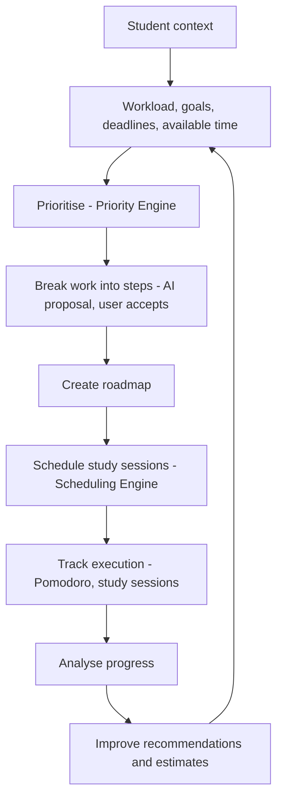
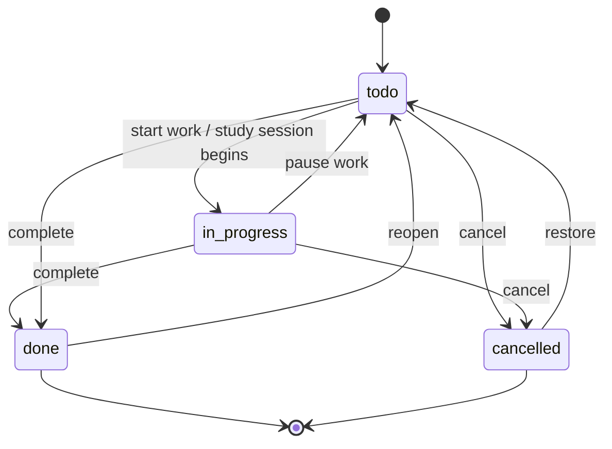
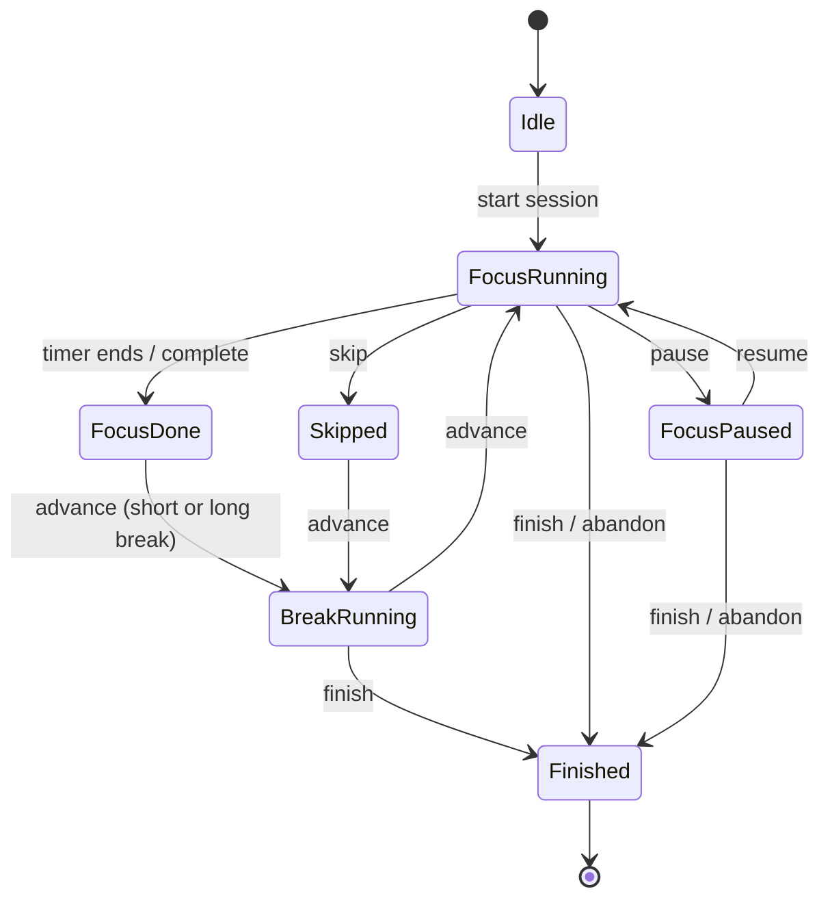
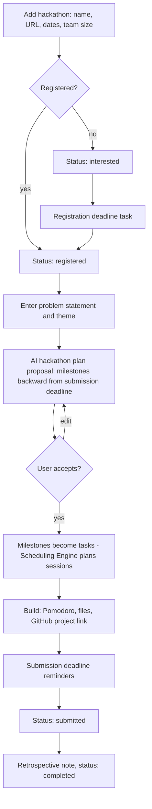

# 01. Product Requirements

**Purpose:** define what StudentOS AI must do, for whom, and in which release tier. **Scope:** functional and non-functional requirements, MVP/post-MVP/future boundaries, core domain workflows.

See also: [System Architecture](02-system-architecture.md) · [Development Roadmap](23-development-roadmap.md) · [Architecture Review](25-architecture-review.md) · [Future Roadmap](24-future-roadmap.md)

## 1. Problem

Students juggle Classroom, calendars, to-do apps, notes, timers, hackathon pages and videos. None of them answer: *what should I work on right now, why, how, how long will it take, when should I do it, what must I learn first, and how am I doing?*

## 2. Personas

| Persona | Situation | Primary needs |
|---|---|---|
| **Priya**, 2nd-year undergraduate | 6 subjects, weekly assignments, midterms | Know today's priorities, avoid missed deadlines |
| **Arjun**, hackathon builder | Side projects, 48-hour events | Backward-planned timelines, team checklist, files in one place |
| **Meera**, final-year, placements | Exams + projects + interview prep | Balance workload with career goals, exam roadmaps |

## 3. Core Intelligence Loop

## 4. Release Tiers

| Tier | Contents |
|---|---|
| **MVP** | Email + Google login; student profile, onboarding, interests, goals; subjects; tasks, subtasks, dependencies; AI task breakdown; basic roadmap; Pomodoro and study sessions; basic analytics; timetable; exams with basic exam roadmap; projects with project tasks and GitHub URL; hackathon workspace; Google Calendar; basic Google Classroom sync; dashboard; AI recommendations; in-app notifications (architectural recommendation, see review M-01/M-05); file attachments for projects and hackathons; minimal admin |
| **Post-MVP** | Advanced recommendations, YouTube assistant, hackathon recommendation engine, AI news, gamification, advanced analytics, Google Drive, email notifications, advanced exam planner, adaptive planning |
| **Future** | Android digital wellbeing, advanced ML recommender, voice assistant, teacher accounts, college dashboards, social features, AI agents, mobile app, cross-college analytics |

## 5. Functional Requirements

Priority: **M** = must (MVP), **P** = post-MVP, **F** = future.

| ID | Requirement | Tier |
|---|---|---|
| FR-AUTH-01 | Register/login with email and password | M |
| FR-AUTH-02 | Login/sign-up with Google | M |
| FR-AUTH-03 | Email verification, password reset, session list and revocation | M |
| FR-ONB-01 | Onboarding captures institution, degree, year, interests, goals, weekly availability, timezone | M |
| FR-SUB-01 | CRUD subjects (name, code, colour, credits, term) | M |
| FR-TSK-01 | CRUD tasks with due date, priority, estimate, subject, status | M |
| FR-TSK-02 | Subtasks with ordering and dependencies; blocked state derived from unmet dependencies | M |
| FR-TSK-03 | Dependency graph must be acyclic | M |
| FR-AI-01 | AI task breakdown returns a validated *proposal* the user accepts, edits or rejects | M |
| FR-PLN-01 | Roadmap generation: breakdown → deterministic schedule → AI explanation | M |
| FR-PLN-02 | "What should I work on now?" returns next best action with reason codes and explanation | M |
| FR-PLN-03 | Conflict detection (overload, impossible deadlines, cycles) reported, never silently dropped | M |
| FR-TTB-01 | Weekly recurring timetable that reduces available time | M |
| FR-FOC-01 | Pomodoro with configurable durations, pause/resume, server-authoritative timing | M |
| FR-FOC-02 | Study sessions logged automatically (Pomodoro) or manually | M |
| FR-ANL-01 | Dashboard: today plan, focus time, plan adherence, estimate accuracy, upcoming deadlines | M |
| FR-EXM-01 | Exams with topics, confidence, exam roadmap with revision passes | M |
| FR-PRJ-01 | Projects with tasks, status, GitHub URL | M |
| FR-HCK-01 | Hackathon workspace: dates, team, problem statement, tasks, files, backward-planned timeline | M |
| FR-GCL-01 | Push planned sessions, exams, deadlines to a dedicated Google Calendar; read free/busy for planning | M |
| FR-GCR-01 | Import Classroom courses and coursework as subjects/tasks (read-only, user-confirmed mapping) | M |
| FR-REC-01 | Explainable recommendations with accept/dismiss feedback | M |
| FR-NOT-01 | In-app notifications for deadlines, sessions, conflicts, sync problems | M |
| FR-FIL-01 | Upload PDF, PPT(X), DOC(X), images to projects/hackathons/subjects | M |
| FR-PRV-01 | Data export, integration disconnect, account deletion | M |
| FR-ADM-01 | Admin sees aggregate metrics, job health, can suspend accounts; no private content by default | M |
| FR-YT-01 | YouTube assistant: summarise/analyse a video, extract study notes | P |
| FR-HRE-01 | Hackathon recommendation engine | P |
| FR-NWS-01 | AI news feed | P |
| FR-GAM-01 | XP, streaks, achievements | P |
| FR-DRV-01 | Import materials from Google Drive (per-file consent) | P |
| FR-EML-01 | Email notifications and digests | P |
| FR-ADP-01 | Adaptive planning using historical behaviour | P |
| FR-FUT-01..09 | Items in [Future Roadmap](24-future-roadmap.md) | F |

## 6. Non-Functional Requirements

Targets are **architectural recommendations** to be confirmed by the owner.

| ID | Requirement | Target |
|---|---|---|
| NFR-PERF-01 | Non-AI API latency | p95 < 300 ms |
| NFR-PERF-02 | AI operations | async; proposal ready p95 < 30 s |
| NFR-AVL-01 | Availability | 99.5% monthly (MVP) |
| NFR-SEC-01 | Security | OWASP ASVS L2 as guide ([Security](17-security.md)) |
| NFR-PRV-01 | Privacy | Data minimisation, export and deletion honoured within 30 days |
| NFR-ACC-01 | Accessibility | WCAG 2.1 AA |
| NFR-RSP-01 | Responsive web | 360 px and up; installable PWA is post-MVP |
| NFR-SCL-01 | Initial scale assumption | 10,000 MAU, ≤ 5,000 tasks per user |
| NFR-REL-01 | Backups | RPO ≤ 15 min, RTO ≤ 4 h |
| NFR-OBS-01 | Observability | Every request traceable by request ID |
| NFR-TZ-01 | Time | UTC storage, per-user IANA timezone, DST-safe scheduling |

## 7. Domain Workflows

### Task lifecycle

`blocked` and `overdue` are derived, not stored.

### Pomodoro lifecycle

The server stores `started_at` and accumulated pause time; clients render countdowns from those timestamps, so reloads and multiple tabs stay correct.

### Hackathon workflow

## 8. Success Metrics

Activation: onboarding completed and one accepted AI breakdown within 24 h. Engagement: weekly active students; planned-session start rate. Value: plan adherence (completed ÷ planned minutes); estimate accuracy trend; on-time task completion rate. Trust: AI proposal acceptance rate; recommendation dismiss rate. Health: sync error rate; AI cost per active user.

## 9. Constraints and Principles

- Productivity analytics only. The system never infers, labels or implies medical or mental-health conditions ([Privacy](18-privacy.md#productivity-analytics-are-not-health-diagnosis)).
- LLM never controls deterministic scheduling ([Task Planning Engine](10-task-planning-engine.md)).
- Private student data is not visible to administrators by default ([Authorization](08-authorization.md)).

## 10. Out of Scope (MVP)

Recurring tasks, teacher/organisation accounts, social features, native mobile apps, offline mode, real-time collaboration, payments, two-way Calendar edits.

## 11. Open Questions

Tracked with proposed resolutions in [Architecture Review](25-architecture-review.md).
