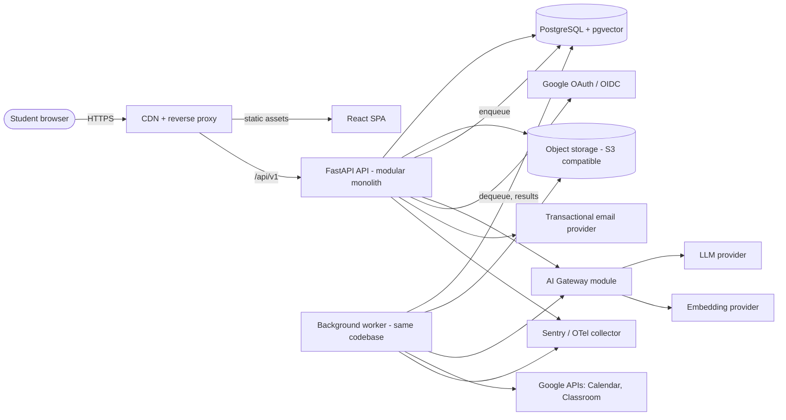
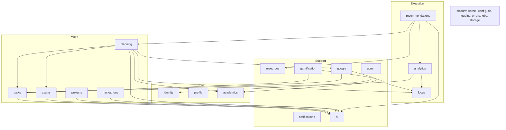
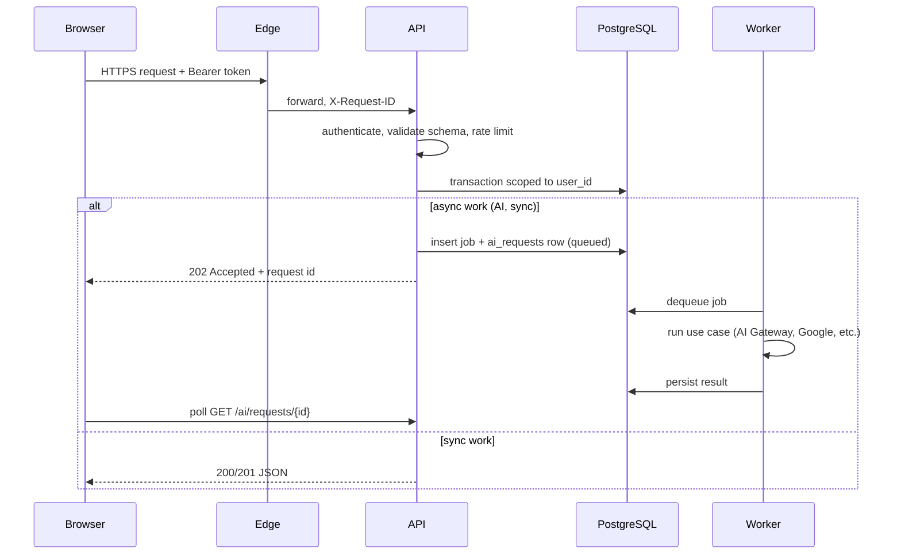

# 02. System Architecture

**Purpose:** describe the overall architecture, components, data flows and cross-cutting concerns. **Scope:** system level; module detail is in [Backend Architecture](04-backend-architecture.md).

See also: [Frontend Architecture](03-frontend-architecture.md) · [Database Design](05-database-design.md) · [Deployment](21-deployment.md) · [ADR 001](adr/001-modular-monolith.md) · [Security](17-security.md)

## 1. System Diagram

## 2. Components

| Component | Responsibility | Tech |
|---|---|---|
| SPA | UI, client-only state, token handling | React, TypeScript |
| Edge | TLS, CDN, routing `/api` to API, coarse rate limits, size limits | CDN + reverse proxy |
| API | HTTP, auth, validation, use cases, enqueue jobs | FastAPI |
| Worker | AI jobs, sync, notifications, aggregation, file scanning | Procrastinate, same image |
| Database | System of record, vectors, job queue | PostgreSQL 16+, pgvector |
| Object storage | Uploaded files, export bundles | S3-compatible |
| AI Gateway | Provider abstraction, validation, quotas | Internal module |
| Integrations | Google OAuth, Calendar, Classroom | Internal module `google` |

One codebase produces two process types (API, worker) from one container image, which keeps deployment simple while allowing independent scaling.

## 3. Module Map

Arrows show allowed call direction through public interfaces. Detailed rules: [Backend Architecture](04-backend-architecture.md#4-module-dependency-rules).

## 4. Request Lifecycle

## 5. Key Data Flows

- **Planning:** tasks, timetable, availability, exams and Calendar free/busy → Constraint Engine → Priority Engine → Scheduling Engine → planned sessions → AI explanation ([doc 10](10-task-planning-engine.md)).
- **AI:** feature service → AI Gateway → provider → schema validation → business validation → proposal stored → user accepts → entities created ([doc 09](09-ai-architecture.md)).
- **Google:** OAuth connect → encrypted token vault → worker sync jobs → domain events ([doc 13](13-google-integrations.md)).
- **Files:** SPA → API validation → object storage; metadata in PostgreSQL ([doc 16](16-file-storage.md)).

## 6. Cross-Cutting Concerns

| Concern | Approach |
|---|---|
| Identity | Access JWT + rotating refresh cookie ([07](07-authentication.md)) |
| Ownership | `user_id` scoping in repositories, composite FKs, optional RLS later ([08](08-authorization.md)) |
| Validation | Pydantic at boundaries; business validators in domain |
| Errors | One error envelope ([06](06-api-specification.md#2-errors)) |
| Observability | Structured logs, request/correlation IDs, OTel, Sentry ([20](20-observability.md)) |
| Config | Environment variables via typed settings ([21](21-deployment.md)) |
| Time | UTC storage, user IANA timezone at the edges |
| Events | In-process domain events within a transaction; jobs for async side effects |

## 7. Quality Attributes and Failure Modes

| Failure | Behaviour |
|---|---|
| LLM down or invalid output | Feature degrades to manual flow; engines still work |
| Google revoked/expired | Connection marked `needs_reauth`, sync stops, user notified, planner continues without free/busy |
| Worker down | API stays up; jobs queue; stuck `queued` AI requests re-enqueued by sweeper |
| Object storage down | Uploads fail with retryable error; rest of app unaffected |
| Database down | Full outage; readiness probe fails; see [Deployment](21-deployment.md) |

## 8. Scaling Path

Stage 1: single API + single worker + managed PostgreSQL. Stage 2: horizontal API replicas, more worker concurrency, PgBouncer, read replica for analytics. Stage 3 (only if measured need): extract worker-heavy modules (for example `ai`) behind existing public interfaces; introduce Redis if per-endpoint distributed rate limits or high job throughput require it ([ADR 009](adr/009-background-jobs.md)).

## 9. Decisions

[001 Modular monolith](adr/001-modular-monolith.md) · [002 PostgreSQL](adr/002-postgresql.md) · [003 pgvector](adr/003-pgvector.md) · [004 FastAPI](adr/004-fastapi.md) · [005 Frontend](adr/005-frontend-stack.md) · [006 Auth](adr/006-authentication-strategy.md) · [007 Google OAuth](adr/007-google-oauth.md) · [008 AI abstraction](adr/008-ai-provider-abstraction.md) · [009 Jobs](adr/009-background-jobs.md) · [010 Object storage](adr/010-object-storage.md)
