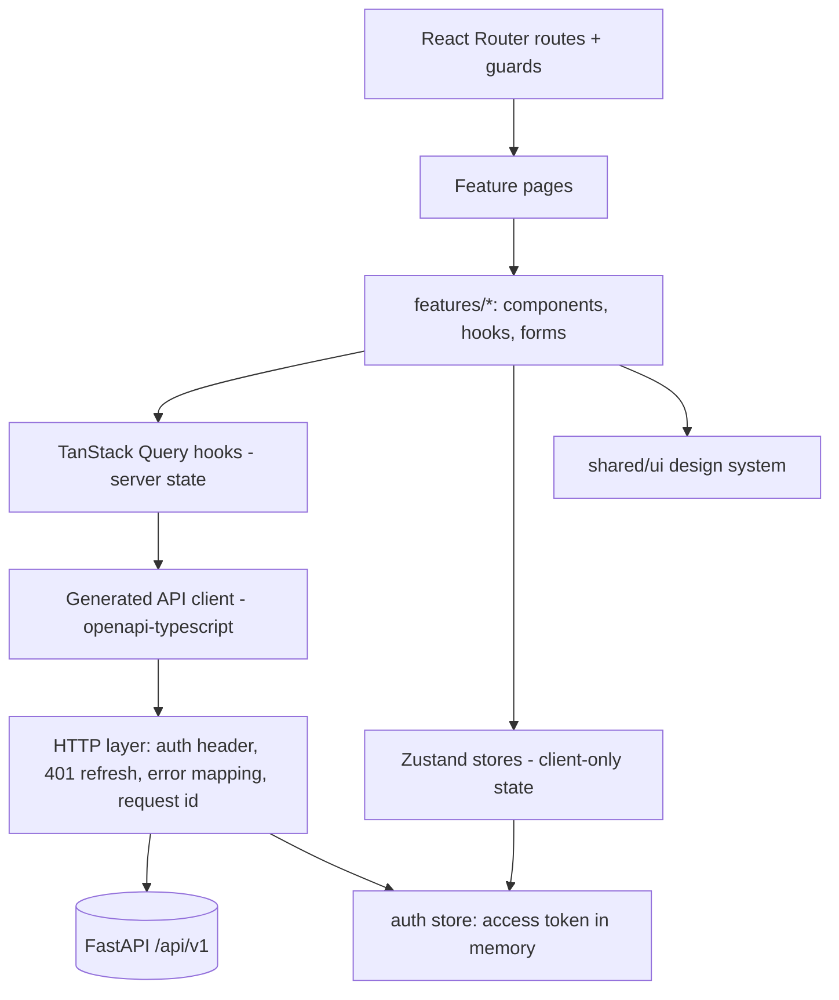

# 03. Frontend Architecture

**Purpose:** define the SPA structure, state rules and conventions. **Scope:** `frontend/` only.

See also: [System Architecture](02-system-architecture.md) · [API Specification](06-api-specification.md) · [Authentication](07-authentication.md) · [Testing Strategy](19-testing-strategy.md) · [ADR 005](adr/005-frontend-stack.md)

## 1. Stack

React, TypeScript (strict), Vite, React Router, TanStack Query, Zustand, Tailwind CSS with accessible primitives (Radix/shadcn pattern), React Hook Form + Zod, Recharts, a calendar component library chosen at Phase 4 (license check required), Vitest + Testing Library + MSW, Playwright. Choices are architectural recommendations recorded in [ADR 005](adr/005-frontend-stack.md).

## 2. Architecture Diagram



## 3. Directory Layout (planned)

```text
frontend/src/
  app/        providers, router, error boundary, layout shell
  features/   auth, onboarding, subjects, tasks, planner, timetable, exams,
              projects, hackathons, focus, analytics, recommendations,
              resources, notifications, integrations, settings, admin
  shared/     ui/, api/ (generated client + http), hooks/, lib/, types/
```

Features mirror backend modules. A feature may import `shared/` but not another feature's internals; cross-feature needs go through a feature's `index.ts`.

## 4. State Management Rules

| State kind | Where | Examples |
|---|---|---|
| Server state | TanStack Query | tasks, roadmaps, exams, notifications |
| Client-only global | Zustand | access token (memory), sidebar, theme, active-timer render state |
| Form state | React Hook Form | task form, onboarding |
| URL state | Router search params | filters, selected week |

Never copy server data into Zustand. Query keys are structured arrays (`['tasks', filters]`); mutations invalidate by key and use optimistic updates only for low-risk toggles (task completion), with rollback on error.

## 5. Routes

| Route | Page | Guard |
|---|---|---|
| `/login`, `/register`, `/auth/callback`, `/verify-email`, `/reset-password` | Auth | public |
| `/onboarding` | Wizard | authenticated, not onboarded |
| `/` | Dashboard: now/next, today plan, deadlines | authenticated + onboarded |
| `/tasks`, `/tasks/:id` | Tasks and detail with subtasks, AI breakdown | same |
| `/planner` | Roadmaps, week view, conflicts | same |
| `/timetable`, `/calendar` | Timetable editor, unified calendar | same |
| `/exams`, `/exams/:id` | Exams and exam roadmap | same |
| `/projects`, `/projects/:id` | Projects | same |
| `/hackathons`, `/hackathons/:id` | Hackathon workspace | same |
| `/focus` | Pomodoro | same |
| `/analytics` | Productivity analytics | same |
| `/resources` | Resources and files | same |
| `/settings/*` | Profile, preferences, integrations, privacy (export, delete) | authenticated |
| `/admin/*` | Admin console | admin role + MFA |

## 6. Authentication Handling

Access token held only in memory. On load, the app calls `POST /auth/refresh` (cookie-based) to restore a session. The HTTP layer retries a request once after a 401 by refreshing; concurrent 401s share one in-flight refresh promise. Logout clears the store and calls `POST /auth/logout`. See [Authentication](07-authentication.md).

## 7. API Client

The client and types are generated from the backend OpenAPI document; CI fails if they drift. The HTTP layer maps the standard error envelope to typed errors (`ValidationError`, `ConflictError`, `RateLimitError`, `AuthError`), carries `request_id` into error UI and Sentry, and attaches `Idempotency-Key` on documented POSTs.

## 8. Async AI UX

AI actions return `202`; the UI shows progress by polling `GET /ai/requests/{id}` with backoff (1 s → 5 s), displays the proposal in an editable review dialog, and only then calls accept. Failures show a clear message and the manual alternative.

## 9. Pomodoro Timer

Countdown is derived from server `started_at` and `paused_total_seconds`, re-synced on focus/visibility change, to survive background-tab throttling. Optimistic UI for pause/resume is reconciled with the server response.

## 10. Quality

Accessibility: semantic HTML, keyboard navigation, focus management in dialogs, colour-contrast tokens, `prefers-reduced-motion`. Security: no `dangerouslySetInnerHTML` without sanitiser; strict CSP; user-supplied Markdown rendered through a sanitising renderer ([Security](17-security.md)). Performance: route-level code splitting, list virtualisation for long lists, skeleton loaders. Errors: route error boundaries plus global boundary reporting to Sentry.

## 11. Failure Cases

| Case | UX |
|---|---|
| Refresh fails | Redirect to `/login` with return path |
| 409 version conflict | Show diff and offer reload or overwrite |
| 429 | Show retry-after |
| Offline | Banner; mutations not queued in MVP |
| AI failure | Inline error with manual path |
