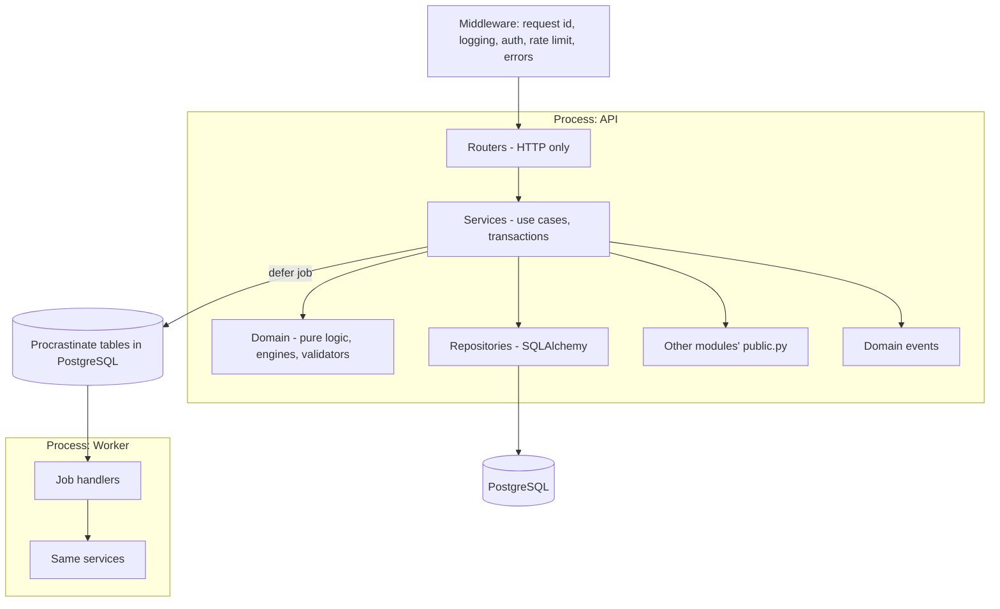

# 04. Backend Architecture

**Purpose:** define the backend modular monolith: layering, module boundaries, transactions, jobs. **Scope:** `backend/`.

See also: [System Architecture](02-system-architecture.md) · [Database Design](05-database-design.md) · [API Specification](06-api-specification.md) · [AI Architecture](09-ai-architecture.md) · [ADR 001](adr/001-modular-monolith.md) · [ADR 004](adr/004-fastapi.md) · [ADR 009](adr/009-background-jobs.md)

## 1. Architecture Diagram



## 2. Module Layout

```text
backend/app/<module>/
  api/         routers.py            FastAPI routers, dependency wiring
  schemas/     requests.py responses.py   Pydantic models
  service/     use cases (transaction boundary)
  domain/      entities, rules, engines (no I/O)
  repository/  SQLAlchemy models + queries (owner-scoped)
  jobs/        background job handlers
  public.py    the ONLY interface other modules may import
  events.py    domain events published by the module
backend/app/platform/   config, db (engine, session, UoW), logging, errors,
                        security (hashing, jwt, crypto), jobs, storage, pagination
```

## 3. Layering Rules

| Layer | May depend on | Must not |
|---|---|---|
| Router | schemas, services, auth dependencies | contain business logic or SQL |
| Service | domain, repositories, other modules' `public.py`, platform | import FastAPI types |
| Domain | standard library, other domain objects | perform I/O, import SQLAlchemy |
| Repository | SQLAlchemy models, platform.db | contain business rules |

## 4. Module Dependency Rules

1. Modules communicate only through `public.py` functions/protocols or domain events.
2. No module imports another module's models, repositories or schemas.
3. Foreign keys across modules are allowed in the shared database, but writes to another module's tables go through its service.
4. `platform` depends on nothing in the app; everything may depend on `platform`.
5. `ai` exposes `AIGateway` only; features never import provider SDKs.
6. Enforced in CI by import-linter contracts.

| Module | Owns | Public interface offers |
|---|---|---|
| identity | users, identities, sessions, audit | `current_user`, `require_role`, audit writer |
| profile | profiles, interests, goals, settings, availability | availability and preferences for planning |
| academics | terms, subjects, timetable | subjects, busy blocks |
| tasks | tasks, subtasks, dependencies | task/subtask queries, completion events |
| planning | roadmaps, planned sessions, engines | next best action, replan trigger |
| exams | exams, topics | exam roadmap inputs |
| projects | projects | project/task creation |
| hackathons | hackathons, team members | timeline inputs |
| focus | study sessions, Pomodoro cycles | session history, active session |
| analytics | daily stats | summaries, estimate-accuracy factor |
| recommendations | recommendations | candidates, feedback |
| resources | resources, files, videos | file metadata, similarity search |
| notifications | notifications, preferences | `notify(user, kind, payload)` |
| gamification | XP, streaks, achievements | profile (post-MVP) |
| google | connections, sync state, Classroom items | free/busy, connection status |
| ai | ai_requests, payloads, usage | `AIGateway` |
| admin | admin grants, feature flags | none (leaf module) |

## 5. Transactions and Units of Work

One database transaction per request, opened by the service via a unit-of-work context, committed on success and rolled back on exception. Repositories receive the session; they never commit. Jobs open their own transaction per unit of work. Domain events are collected and dispatched after commit; synchronous in-transaction subscribers are limited to same-module logic.

Async SQLAlchemy rules: `expire_on_commit=False`, explicit eager loading (`selectinload`), no lazy loading in async code, one session per request/job.

## 6. Errors

Domain and service code raise typed exceptions (`NotFound`, `Conflict`, `ValidationFailed`, `Forbidden`, `RateLimited`, `UpstreamUnavailable`). A global handler maps them to the error envelope in [API Specification](06-api-specification.md#2-errors) with `request_id`. Unhandled exceptions return `500 internal_error` with no internal details and are reported to Sentry.

## 7. Background Jobs

Procrastinate, queues: `ai`, `sync`, `notifications`, `maintenance`, `default`. Jobs are idempotent, carry `correlation_id`, have retry with exponential backoff and a dead-letter state visible to admin. After commit, services defer jobs; a periodic sweeper re-enqueues rows stuck in `queued` (for example AI requests older than 2 minutes), covering enqueue failure between commit and defer. Periodic jobs: notification scheduler (every minute), Calendar/Classroom polling, analytics aggregation (hourly), planned-session missed marker, purge (soft-deleted rows, expired AI payloads, expired exports), orphaned-object reconciliation, recommendation refresh (nightly). Job inventory per module: [Notification System](14-notification-system.md), [Google Integrations](13-google-integrations.md), [Recommendation Engine](12-recommendation-engine.md).

## 8. API Conventions

Versioned `/api/v1`; cursor pagination (`limit` ≤ 100, default 25, opaque `cursor`); filtering by documented query params; `Idempotency-Key` on documented POSTs (stored in `idempotency_keys` for 24 h); optimistic concurrency via `version` field on tasks, subtasks and planned sessions; OpenAPI generated and exported in CI.

## 9. Configuration

Typed settings loaded from environment (pydantic-settings), validated at startup, failing fast on missing secrets. No config read from the database except feature flags. Variables: [Deployment](21-deployment.md#3-environment-variables).

## 10. Logging and Request Context

Middleware assigns `request_id` (accepts a valid `X-Request-ID` from the edge), binds `user_id`, `request_id`, `correlation_id` to structured logs, and returns `X-Request-ID`. See [Observability](20-observability.md).

## 11. Failure Cases

| Failure | Handling |
|---|---|
| Transaction conflict / serialization | Retry once in service for known hot paths, else 409/500 |
| Job crash mid-run | Retry; idempotency keys and status checks prevent duplicates |
| Event handler failure after commit | Logged, retried via job; does not roll back the user's request |
| Pool exhaustion | Readiness degraded, alert; PgBouncer in stage 2 |
