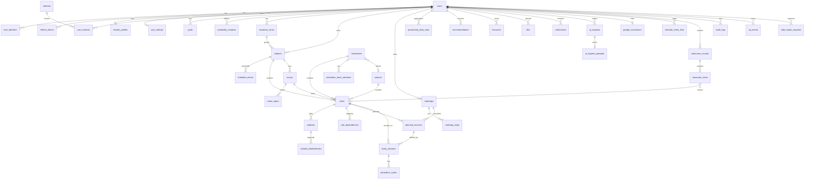

# 05. Database Design

**Purpose:** authoritative schema design for PostgreSQL 16+ with pgvector. **Scope:** entities, columns, keys, constraints, indexes, lifecycle rules. No migration code is included.

See also: [System Architecture](02-system-architecture.md) · [Backend Architecture](04-backend-architecture.md) · [API Specification](06-api-specification.md) · [Authorization](08-authorization.md) · [Privacy](18-privacy.md) · [ADR 002](adr/002-postgresql.md) · [ADR 003](adr/003-pgvector.md)

## 1. Conventions

| Topic | Rule |
|---|---|
| **UUID strategy** | `id uuid` primary keys, **UUIDv7** generated by the application (time-ordered, index friendly, non-guessable). Column default `gen_random_uuid()` as fallback for manual inserts. Natural-key tables are noted. |
| **Timestamps** | `timestamptz` in UTC. `created_at NOT NULL DEFAULT now()`, `updated_at NOT NULL DEFAULT now()` maintained by trigger `set_updated_at()`. Calendar dates use `date`; timetable wall-clock uses `time` interpreted in the user's IANA timezone. |
| **Enums** | `text` with `CHECK (col IN (...))`, not PG enum types (easier migrations). Allowed values are listed per table. |
| **Ownership** | Every user-owned table has `user_id uuid NOT NULL REFERENCES users(id) ON DELETE CASCADE`. Parents referenced by children expose `UNIQUE (id, user_id)`, and children use **composite FKs** `(parent_id, user_id)` so a row can never reference another user's parent. |
| **Soft deletion** | `deleted_at timestamptz NULL` on user-content tables marked **SD**. Queries filter `deleted_at IS NULL`; unique indexes are partial (`WHERE deleted_at IS NULL`). Services soft-delete children with the parent. Purge job hard-deletes after 30 days; hard delete cascades (`ON DELETE CASCADE`) to dependents, and optional history references use `ON DELETE SET NULL`. |
| **Audit** | `audit_logs` is append-only (application role has INSERT/SELECT only) for security and admin events. No per-row history in MVP. |
| **Concurrency** | `version integer NOT NULL DEFAULT 1` on tasks, subtasks, planned_sessions; PATCH carries expected version; mismatch → 409. |
| **Naming** | snake_case plural tables; `ix_`, `uq_`, `ck_`, `fk_` prefixes; FK columns `<entity>_id`. |
| **Embeddings** | `vector(1024)`; changing the embedding model with a different dimension requires a re-embedding migration ([ADR 003](adr/003-pgvector.md)). |
| **Money** | `numeric(12,6)` USD for AI cost. |
| **Abbreviations** | **STD** = `id`, `created_at`, `updated_at`. **OWN** = `user_id` as above. **SD** = `deleted_at`. Every FK column is indexed unless stated. |

## 2. ER Diagram

## 3. Entity Overview

| Entity | Purpose | Module | Tier |
|---|---|---|---|
| users, auth_identities, refresh_tokens, one_time_tokens, login_attempts, consents, user_mfa_factors | Identity and sessions | identity | MVP (MFA: hardening) |
| audit_logs, idempotency_keys | Security audit, POST dedupe | identity / platform | MVP |
| student_profiles, user_settings, interests, user_interests, goals, availability_windows | Student context | profile | MVP |
| academic_terms, subjects, timetable_entries | Academic structure | academics | MVP |
| tasks, subtasks, task_dependencies, subtask_dependencies | Work items | tasks | MVP |
| roadmaps, roadmap_steps, planned_sessions | Plans and schedule | planning | MVP |
| exams, exam_topics | Exam planning | exams | MVP |
| projects | Projects | projects | MVP |
| hackathons, hackathon_team_members | Hackathon workspace | hackathons | MVP |
| study_sessions, pomodoro_cycles | Execution tracking | focus | MVP |
| productivity_daily_stats | Analytics rollup | analytics | MVP |
| recommendations | Recommendations | recommendations | MVP |
| resources, files | Library and uploads | resources | MVP |
| video_analyses | YouTube assistant | resources | Post-MVP |
| news_articles, user_news_items | AI news | recommendations | Post-MVP |
| notifications, notification_preferences | Notifications | notifications | MVP |
| xp_events, achievements, user_achievements, streaks | Gamification | gamification | Post-MVP |
| google_connections, calendar_event_links, classroom_courses, classroom_items, sync_runs | Google integration | google | MVP |
| ai_requests, ai_request_payloads, ai_usage_daily | AI logging and quotas | ai | MVP |
| data_export_requests | Privacy export | identity | MVP |
| admin_access_grants, feature_flags | Admin | admin | MVP (minimal) |
| Procrastinate tables | Job queue (library-managed schema `procrastinate_*`) | platform | MVP |

## 4. Tables

### 4.1 Identity

**users** (STD) — `email citext NOT NULL`, `email_verified_at timestamptz`, `password_hash text` (null for Google-only), `role text NOT NULL DEFAULT 'student' CHECK IN ('student','admin')`, `status text NOT NULL DEFAULT 'active' CHECK IN ('active','suspended','pending_deletion')`, `timezone text NOT NULL DEFAULT 'UTC'`, `locale text NOT NULL DEFAULT 'en'`, `last_login_at`, `deletion_requested_at`. Unique: `uq_users_email (email)`. Check: `password_hash IS NOT NULL OR EXISTS identity` enforced in service. Index: `(status)`, `(deletion_requested_at) WHERE deletion_requested_at IS NOT NULL`.

**auth_identities** (STD, OWN) — `provider text CHECK IN ('google')`, `provider_subject text NOT NULL`, `email citext`. Unique `(provider, provider_subject)`, `(user_id, provider)`.

**refresh_tokens** (STD, OWN) — `family_id uuid NOT NULL`, `token_hash bytea NOT NULL` (SHA-256), `expires_at`, `idle_expires_at`, `revoked_at`, `revoked_reason text`, `replaced_by_id uuid REFERENCES refresh_tokens(id)`, `user_agent text`, `ip_hash bytea`, `last_used_at`. Unique `(token_hash)`. Index `(user_id, revoked_at)`, `(family_id)`, `(expires_at)`.

**one_time_tokens** (STD, OWN) — `purpose text CHECK IN ('email_verify','password_reset')`, `token_hash bytea NOT NULL`, `expires_at`, `consumed_at`. Unique `(token_hash)`. Index `(user_id, purpose)`.

**login_attempts** (STD) — `email_hash bytea NOT NULL`, `ip_hash bytea NOT NULL`, `succeeded boolean`. Index `(email_hash, created_at)`, `(ip_hash, created_at)`. Purged after 30 days.

**consents** (STD, OWN) — `consent_type text CHECK IN ('terms','privacy','ai_processing','google_calendar','google_classroom','google_drive','analytics')`, `version text NOT NULL`, `granted boolean NOT NULL`. Index `(user_id, consent_type, created_at DESC)`. Append-only; latest row wins.

**user_mfa_factors** (STD, OWN; Phase 19) — `kind text CHECK IN ('totp')`, `secret_encrypted bytea`, `confirmed_at`, `last_used_at`. Unique `(user_id, kind)`.

**audit_logs** (id, created_at; append-only) — `actor_user_id uuid REFERENCES users(id) ON DELETE SET NULL`, `actor_role text`, `action text NOT NULL`, `resource_type text`, `resource_id uuid`, `target_user_id uuid ON DELETE SET NULL`, `metadata jsonb NOT NULL DEFAULT '{}'` (no content, no secrets), `ip_hash bytea`, `request_id text`. Index `(actor_user_id, created_at DESC)`, `(target_user_id, created_at DESC)`, `(action, created_at DESC)`.

**idempotency_keys** — PK `(user_id, key)`, `request_hash bytea`, `response_status int`, `response_body jsonb`, `created_at`. FK user CASCADE. Purged after 24 h.

**data_export_requests** (STD, OWN) — `status text CHECK IN ('queued','running','ready','failed','expired')`, `file_id uuid REFERENCES files(id) ON DELETE SET NULL`, `expires_at`, `completed_at`.

### 4.2 Student Context

**student_profiles** — PK/FK `user_id` (1:1, CASCADE), `display_name text NOT NULL`, `institution_name text`, `degree text`, `major text`, `year_of_study smallint CHECK BETWEEN 1 AND 10`, `graduation_year smallint CHECK BETWEEN 2000 AND 2100`, `onboarding_completed_at`, STD timestamps.

**user_settings** — PK/FK `user_id` (CASCADE), `pomodoro_focus_minutes smallint DEFAULT 25 CHECK 5..120`, `pomodoro_short_break_minutes smallint DEFAULT 5 CHECK 1..30`, `pomodoro_long_break_minutes smallint DEFAULT 15 CHECK 5..60`, `pomodoro_cycles_before_long_break smallint DEFAULT 4 CHECK 2..8`, `week_starts_on smallint DEFAULT 1 CHECK 1..7`, `daily_study_target_minutes smallint CHECK 0..960`, `quiet_hours_start time`, `quiet_hours_end time`, `ai_features_enabled boolean DEFAULT true`, `ai_personalization_enabled boolean DEFAULT true`, `theme text DEFAULT 'system'`.

**interests** (STD; global) — `name text NOT NULL`, `category text`. Unique `(lower(name))`. **user_interests** — PK `(user_id, interest_id)`, both CASCADE.

**goals** (STD, OWN, SD) — `title text NOT NULL`, `category text CHECK IN ('academic','career','skill','project','other')`, `description text`, `target_date date`, `status text DEFAULT 'active' CHECK IN ('active','achieved','dropped')`, `priority smallint CHECK 1..4`. Index `(user_id, status)`.

**availability_windows** (STD, OWN) — `weekday smallint CHECK 1..7` (ISO), `start_time time NOT NULL`, `end_time time NOT NULL`, `kind text CHECK IN ('study','blocked')`; `CHECK (end_time > start_time)`. Index `(user_id, weekday)`.

### 4.3 Academics

**academic_terms** (STD, OWN) — `name text`, `start_date date`, `end_date date`; `CHECK end_date > start_date`. Unique `(id, user_id)`.

**subjects** (STD, OWN, SD) — `term_id uuid` (composite FK `(term_id,user_id)` → terms, SET NULL via service), `name text NOT NULL`, `code text`, `color char(7) CHECK ~ '^#[0-9A-Fa-f]{6}$'`, `credits numeric(4,1) CHECK 0..40`, `instructor text`, `archived_at`. Unique `(id,user_id)`; partial unique `(user_id, term_id, lower(name)) WHERE deleted_at IS NULL`. Index `(user_id, archived_at)`.

**timetable_entries** (STD, OWN, SD) — `subject_id` (composite FK), `title text`, `kind text CHECK IN ('lecture','lab','tutorial','other')`, `weekday smallint CHECK 1..7`, `start_time time`, `end_time time`, `location text`, `valid_from date NOT NULL`, `valid_until date`; `CHECK end_time > start_time`, `CHECK valid_until IS NULL OR valid_until >= valid_from`. Index `(user_id, weekday)`.

### 4.4 Work Items

**tasks** (STD, OWN, SD) — `subject_id`, `project_id`, `hackathon_id`, `exam_id` (all nullable composite FKs), `title text NOT NULL CHECK length 1..200`, `description text`, `status text DEFAULT 'todo' CHECK IN ('todo','in_progress','done','cancelled')`, `priority smallint DEFAULT 2 CHECK 1..4`, `due_at timestamptz`, `estimated_minutes int CHECK 5..1440`, `estimate_source text CHECK IN ('user','ai','derived')`, `source text DEFAULT 'manual' CHECK IN ('manual','classroom','ai')`, `completed_at`, `position int`, `embedding vector(1024)` (Phase 15, nullable), `version int`. Checks: `num_nonnulls(project_id, hackathon_id, exam_id) <= 1`; `status='done' ⇒ completed_at IS NOT NULL`. Unique `(id,user_id)`. Indexes: `(user_id, status, due_at) WHERE deleted_at IS NULL`, `(user_id, subject_id)`, `(project_id)`, `(hackathon_id)`, `(exam_id)`, `(user_id, due_at)`.

**subtasks** (STD, OWN, SD) — `task_id uuid NOT NULL` (composite FK, CASCADE), `title`, `description`, `status` (same set), `estimated_minutes int CHECK 5..480`, `position int NOT NULL`, `due_at`, `ai_generated boolean`, `ai_request_id uuid REFERENCES ai_requests(id) ON DELETE SET NULL`, `completed_at`, `version`. Unique `(id,user_id)`, `(task_id, position) DEFERRABLE`. Index `(task_id)`.

**task_dependencies** — PK `(task_id, depends_on_task_id)`, `user_id` OWN; both composite FKs CASCADE; `CHECK task_id <> depends_on_task_id`. **subtask_dependencies** — same shape; service enforces same parent task. Acyclicity enforced in the service via DFS inside the transaction ([doc 10](10-task-planning-engine.md#6-dependency-resolution)).

### 4.5 Planning

**roadmaps** (STD, OWN) — `scope_type text CHECK IN ('task','exam','project','hackathon','goal')`, `scope_id uuid NOT NULL` (validated in service; one scope table per type, so no FK), `title`, `status text CHECK IN ('draft','active','superseded','archived')`, `horizon_start date`, `horizon_end date`, `generated_by text CHECK IN ('engine','ai_assisted')`, `explanation text`, `constraints_snapshot jsonb`, `conflicts jsonb`, `ai_request_id uuid REFERENCES ai_requests ON DELETE SET NULL`. Partial unique `(user_id, scope_type, scope_id) WHERE status='active'`. Index `(user_id, status)`.

**roadmap_steps** (STD, OWN) — `roadmap_id` (CASCADE), `position int`, `title`, `description`, `target_date date`, `task_id`, `subtask_id` (composite FKs, SET NULL). Unique `(roadmap_id, position)`.

**planned_sessions** (STD, OWN) — `roadmap_id` (CASCADE), `task_id`, `subtask_id`, `exam_id` (SET NULL), `starts_at timestamptz NOT NULL`, `ends_at timestamptz NOT NULL`, `status text CHECK IN ('planned','in_progress','completed','skipped','missed')`, `locked boolean DEFAULT false`, `reason_codes text[]`, `explanation text`, `version`. Checks: `ends_at > starts_at`; `num_nonnulls(task_id, subtask_id, exam_id) >= 1`. Index `(user_id, starts_at)`, `(roadmap_id)`, `(user_id, status, ends_at)`. Exclusion (recommended): `EXCLUDE USING gist (user_id WITH =, tstzrange(starts_at, ends_at) WITH &&) WHERE status IN ('planned','in_progress')` to prevent overlapping sessions (needs `btree_gist`).

### 4.6 Exams, Projects, Hackathons

**exams** (STD, OWN, SD) — `subject_id` (composite FK), `title`, `exam_type text CHECK IN ('midterm','final','quiz','viva','other')`, `starts_at timestamptz NOT NULL`, `duration_minutes int CHECK 15..600`, `location`, `weightage_percent numeric(5,2) CHECK 0..100`, `syllabus_notes text`. Unique `(id,user_id)`. Index `(user_id, starts_at)`.

**exam_topics** (STD, OWN) — `exam_id` (CASCADE), `title`, `confidence smallint DEFAULT 3 CHECK 1..5`, `estimated_minutes int`, `status text DEFAULT 'not_started' CHECK IN ('not_started','studying','revised')`, `position int`. Unique `(exam_id, position)`.

**projects** (STD, OWN, SD) — `subject_id`, `title`, `description`, `github_url text CHECK ~ '^https://github\.com/[A-Za-z0-9_.-]+/[A-Za-z0-9_.-]+/?$'`, `status text CHECK IN ('idea','active','paused','completed','archived')`, `start_date`, `target_date`, `tech_stack text[]`. Unique `(id,user_id)`.

**hackathons** (STD, OWN, SD) — `name`, `organizer`, `url text CHECK ~ '^https?://'`, `mode text CHECK IN ('online','offline','hybrid')`, `registration_deadline timestamptz`, `starts_at`, `ends_at`, `submission_deadline timestamptz`, `team_size smallint CHECK 1..20`, `theme`, `problem_statement text`, `status text CHECK IN ('interested','registered','in_progress','submitted','completed','abandoned')`, `project_id` (composite FK, SET NULL), `notes text`; `CHECK ends_at >= starts_at`. Unique `(id,user_id)`.

**hackathon_team_members** (STD, OWN) — `hackathon_id` (CASCADE), `name text NOT NULL`, `role text`, `contact text` (optional, free text, user-entered about a third party; see [Privacy](18-privacy.md)).

### 4.7 Execution

**study_sessions** (STD, OWN) — `task_id`, `subtask_id`, `subject_id`, `exam_id`, `planned_session_id` (composite FKs, SET NULL), `started_at timestamptz NOT NULL`, `ended_at`, `status text CHECK IN ('active','completed','abandoned')`, `source text CHECK IN ('pomodoro','manual')`, `focus_seconds int DEFAULT 0 CHECK >= 0`, `rating smallint CHECK 1..5`, `notes text`. Checks: `ended_at IS NULL OR ended_at >= started_at`. Partial unique `(user_id) WHERE status='active'` (one active session). Index `(user_id, started_at DESC)`, `(task_id)`, `(subject_id)`.

**pomodoro_cycles** (STD, OWN) — `study_session_id` (CASCADE), `kind text CHECK IN ('focus','short_break','long_break')`, `planned_seconds int CHECK > 0`, `started_at`, `paused_at`, `paused_total_seconds int DEFAULT 0`, `ended_at`, `status text CHECK IN ('running','paused','completed','skipped','abandoned')`. Index `(study_session_id, started_at)`.

**productivity_daily_stats** — PK `(user_id, stat_date)`, `focus_seconds`, `sessions_count`, `tasks_completed`, `planned_minutes`, `completed_planned_minutes`, `estimate_ratio_sum numeric`, `estimate_ratio_count int`, `computed_at`. FK CASCADE. Rebuildable from source rows.

### 4.8 Recommendations, Resources, Files, Notifications

**recommendations** (STD, OWN) — `kind text CHECK IN ('next_task','overdue_rescue','exam_prep','subject_balance','break','resource','hackathon','news')`, `title`, `body`, `reason text NOT NULL`, `reason_codes text[]`, `payload jsonb`, `score numeric(6,4)`, `status text DEFAULT 'new' CHECK IN ('new','seen','accepted','dismissed','expired')`, `source text CHECK IN ('rules','ai')`, `expires_at timestamptz`, `ai_request_id`, `dedupe_key text`. Unique `(user_id, dedupe_key) WHERE status IN ('new','seen')`. Index `(user_id, status, score DESC)`.

**resources** (STD, OWN, SD) — `kind text CHECK IN ('link','video','article','document','note')`, `title`, `url text`, `file_id` (SET NULL), `subject_id`, `task_id` (SET NULL), `summary text`, `body text` (notes), `embedding vector(1024)`, `embedding_model text`. Check: `url IS NOT NULL OR file_id IS NOT NULL OR body IS NOT NULL`. Index `(user_id, subject_id)`; no vector index until measured need (per-user exact scan after `user_id` filter).

**files** (STD, OWN, SD) — `storage_key text NOT NULL UNIQUE`, `original_filename text`, `mime_type text` (detected), `size_bytes bigint CHECK > 0`, `sha256 bytea`, `status text CHECK IN ('pending_scan','available','quarantined','deleted')`, `purpose text CHECK IN ('subject_material','task_attachment','project_file','hackathon_file','export')`, `subject_id`, `task_id`, `project_id`, `hackathon_id` (composite FKs, CASCADE). Check: `purpose='export' OR num_nonnulls(subject_id, task_id, project_id, hackathon_id) = 1`. Index each FK, `(user_id, status)`.

**video_analyses** (post-MVP; STD, OWN) — `resource_id` (CASCADE), `video_id text`, `summary`, `key_points jsonb`, `chapters jsonb`, `ai_request_id`. Unique `(user_id, video_id)`.

**news_articles** (post-MVP; STD; global, not user-owned) — `source`, `url UNIQUE`, `title`, `summary`, `published_at`, `topics text[]`, `embedding vector(1024)`. **user_news_items** (OWN) — `article_id`, `score`, `status`.

**notifications** (STD, OWN) — `kind text`, `title`, `body`, `payload jsonb`, `channel text DEFAULT 'in_app' CHECK IN ('in_app','email','push')`, `status text CHECK IN ('pending','sent','failed')`, `scheduled_for timestamptz NOT NULL`, `sent_at`, `read_at`, `dedupe_key text NOT NULL`. Unique `(user_id, dedupe_key, channel)`. Index `(status, scheduled_for) WHERE status='pending'`, `(user_id, read_at, created_at DESC)`.

**notification_preferences** — PK `(user_id, kind, channel)`, `enabled boolean`.

### 4.9 Gamification (post-MVP)

**xp_events** (STD, OWN) — `event_type text`, `points int`, `source_type text`, `source_id uuid`. Unique `(user_id, event_type, source_type, source_id)` (idempotent awards). **achievements** — PK `code text`, `name`, `description`, `criteria jsonb`. **user_achievements** — PK `(user_id, achievement_code)`, `earned_at`. **streaks** — PK `user_id`, `current_days`, `longest_days`, `last_active_date`.

### 4.10 Google Integration

**google_connections** (STD, OWN) — `google_subject text`, `google_email citext`, `granted_scopes text[] NOT NULL`, `refresh_token_encrypted bytea`, `token_key_id text`, `access_token_encrypted bytea`, `access_token_expires_at`, `status text CHECK IN ('active','needs_reauth','revoked','error')`, `last_error_code text`, `connected_at`, `revoked_at`. Unique `(user_id)`.

**calendar_event_links** (STD, OWN) — `planned_session_id`, `exam_id`, `task_id`, `hackathon_id` (composite FKs, CASCADE), `google_calendar_id`, `google_event_id`, `etag`, `sync_status text CHECK IN ('synced','pending','failed','externally_modified','deleted_remote')`, `last_synced_at`. Check `num_nonnulls(...) = 1`. Unique `(user_id, google_calendar_id, google_event_id)`; one link per entity via partial unique indexes on each FK.

**classroom_courses** (STD, OWN) — `google_course_id text`, `name`, `section`, `state`, `subject_id` (composite FK, SET NULL; user-confirmed mapping), `sync_enabled boolean`, `last_synced_at`. Unique `(user_id, google_course_id)`.

**classroom_items** (STD, OWN) — `classroom_course_id` (CASCADE), `google_coursework_id text`, `title`, `due_at`, `state`, `submission_state`, `task_id` (composite FK, SET NULL), `content_hash bytea`, `overridden_fields text[] DEFAULT '{}'`, `last_seen_at`. Unique `(user_id, google_coursework_id)`.

**sync_runs** (STD, OWN) — `provider text CHECK IN ('calendar','classroom')`, `trigger text CHECK IN ('schedule','manual','event')`, `status text CHECK IN ('running','succeeded','partial','failed')`, `started_at`, `finished_at`, `stats jsonb`, `error_code text`. Index `(user_id, provider, started_at DESC)`. Purged after 90 days.

### 4.11 AI

**ai_requests** (STD, OWN) — `feature text NOT NULL`, `prompt_version text`, `provider text`, `model text`, `status text CHECK IN ('queued','running','succeeded','failed','rejected')`, `failure_reason text CHECK IN ('provider_error','timeout','schema_invalid','business_invalid','quota_exceeded','safety_rejected','disabled')`, `attempts smallint`, `input_tokens int`, `output_tokens int`, `cost_usd numeric(12,6)`, `latency_ms int`, `input_ref jsonb` (ids only), `result jsonb` (validated proposal), `review_status text CHECK IN ('pending','accepted','rejected','expired')`, `validation_errors jsonb`, `correlation_id text`, `completed_at`. Index `(user_id, created_at DESC)`, `(status, created_at) WHERE status IN ('queued','running')`.

**ai_request_payloads** — PK/FK `ai_request_id` (CASCADE), `prompt_encrypted bytea`, `response_encrypted bytea`, `expires_at timestamptz NOT NULL` (default created + 14 days). Purged by job.

**ai_usage_daily** — PK `(user_id, usage_date, feature)`, `requests int`, `input_tokens bigint`, `output_tokens bigint`, `cost_usd numeric(12,6)`. Drives quotas.

### 4.12 Admin

**admin_access_grants** (STD) — `admin_user_id`, `target_user_id` (both `REFERENCES users ON DELETE CASCADE`), `reason text NOT NULL`, `user_consent_at timestamptz NOT NULL`, `scope text CHECK IN ('support_view')`, `expires_at timestamptz NOT NULL`, `revoked_at`. Check `expires_at <= created_at + interval '7 days'`. **feature_flags** — PK `key text`, `enabled boolean`, `rollout_percent smallint CHECK 0..100`, `updated_by`.

## 5. Index Strategy

Index every FK and every documented filter/sort path. Hot paths: tasks by `(user_id, status, due_at)`, planned sessions by `(user_id, starts_at)`, notifications due scan `(status, scheduled_for)` partial, AI quotas via `ai_usage_daily` PK. Use partial indexes for soft-deleted and active-only subsets. Review with `EXPLAIN` in integration tests for the top 10 queries; add vector indexes (HNSW) only when a per-user exact scan is measurably too slow.

## 6. Cascading Summary

| Relationship | Rule |
|---|---|
| users → every owned table | `ON DELETE CASCADE` (account deletion) |
| tasks → subtasks, dependencies, planned sessions, roadmap steps | CASCADE on hard delete (soft delete first) |
| exams → exam_topics | CASCADE |
| study_sessions.task_id and similar history references | `SET NULL` (history survives purge) |
| files → resources.file_id | `SET NULL` |
| ai_requests → children referencing it | `SET NULL`; payloads CASCADE |
| audit_logs → users | `SET NULL` (audit survives, user hashed in metadata at deletion) |

## 7. Data Ownership Rules

1. Every user-owned row carries `user_id`; repositories always filter by it.
2. Composite ownership FKs make cross-user references impossible at the database level.
3. Global tables (`interests`, `achievements`, `news_articles`, `feature_flags`) contain no student data.
4. Administrators never get table-level access to content tables through the application role used by the API ([Authorization](08-authorization.md)).

## 8. Failure Cases and Notes

- Deleting a subject with tasks: soft-delete cascades in service; hard purge detaches via `SET NULL` where configured, otherwise the purge job deletes dependents in order.
- Overlap exclusion constraint failures return `409 conflict` with the conflicting session.
- Timezone changes recompute future planned sessions via a replan job; stored UTC instants are not rewritten silently.
