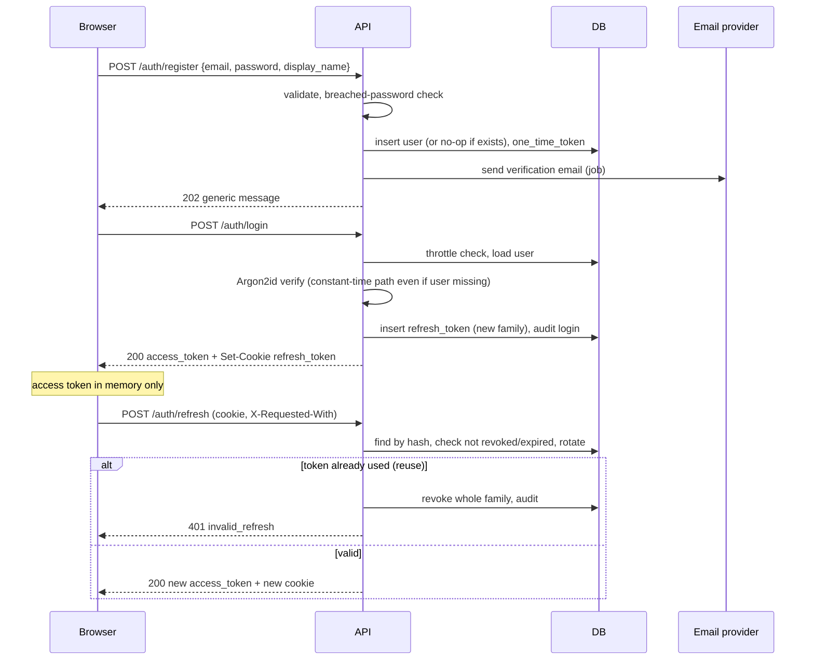
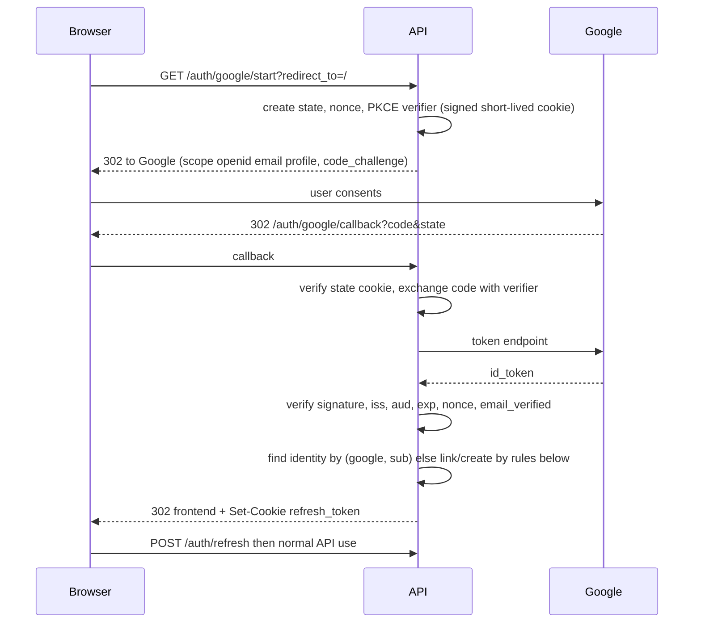

# 07. Authentication

**Purpose:** define how users prove identity and keep sessions. **Scope:** email/password, Google sign-in, tokens, sessions, account recovery. Authorization is in [08](08-authorization.md); Google *integration* scopes are in [13](13-google-integrations.md).

See also: [Security](17-security.md) · [API Specification](06-api-specification.md#41-authentication-auth) · [Database Design](05-database-design.md#41-identity) · [ADR 006](adr/006-authentication-strategy.md) · [ADR 007](adr/007-google-oauth.md)

## 1. Design Summary

| Element | Decision |
|---|---|
| Password hashing | **Argon2id** (`argon2-cffi`), starting parameters m = 64 MiB, t = 3, p = 1, tuned so one hash takes roughly 100–250 ms on production hardware; hashes carry parameters so they can be upgraded on login |
| Password policy | Minimum 10 characters, no composition rules, maximum 128; reject known-breached passwords via k-anonymity range check (privacy-preserving) when available; never silently truncate |
| Access token | JWT, **15 min**, `HS256` with `JWT_SECRET` (≥ 64 random bytes), claims `sub, role, sid, iat, exp, jti, iss, aud`; held in browser memory only |
| Refresh token | Opaque 256-bit random value, stored as SHA-256 hash, **rotated on every use**, reuse detection revokes the family, 30-day absolute lifetime, 14-day idle lifetime |
| Refresh cookie | `refresh_token`, `HttpOnly; Secure; SameSite=Strict; Path=/api/v1/auth` |
| Google sign-in | OIDC authorization-code flow with **PKCE, state, nonce**; ID token verified (signature via Google JWKS, `iss`, `aud`, `exp`, `nonce`, `email_verified`) |
| Email verification | Required for password reset, Google integrations and data export; app use allowed with a banner (recommendation) |
| Throttling | Per email and per IP on login, register, forgot-password using `login_attempts`; progressive delay rather than hard lockout (avoids lockout-as-DoS) |
| MFA | TOTP required for admins (Phase 19); optional for students post-MVP |

JWT claims are intentionally minimal. Anything mutable (status, role changes, suspension) is re-checked against the database when security-relevant, and `sid` lets a revoked session's access token be rejected within its 15-minute life for sensitive endpoints.

## 2. Email Registration and Login

### Enumeration resistance

Register, login and forgot-password return uniform responses and timings regardless of whether the email exists. Login always runs a dummy Argon2 verification when the user is unknown.

## 3. Google Sign-In (OIDC)

Rules: login scopes are only `openid email profile` (non-sensitive). Identity is keyed on Google `sub`, never on email. `redirect_to` must be an allowlisted relative path.

**Account linking and pre-hijacking:** if a local account with the same email exists and its email is verified, link the Google identity; if it exists but is **unverified**, invalidate its password and sessions, then link (prevents an attacker who pre-registered the victim's email from retaining access). If `email_verified` is false in the ID token, reject.

## 4. Session Management

Each login creates a refresh-token family (one device session). Users can list sessions (user agent, last used) and revoke any; password change/reset and "log out everywhere" revoke all families. Suspended or pending-deletion accounts fail refresh. Expired rows are purged by the maintenance job.

## 5. Password Reset and Verification

One-time tokens are 256-bit random, stored hashed, single-use, expiring in 1 h (reset) or 24 h (verification). Reset revokes all sessions and sends a notification email. Tokens are only ever delivered by email links to the frontend; the API accepts them in POST bodies, never in query strings.

## 6. CSRF and Cookie Rules

The refresh endpoint is the only cookie-authenticated mutation. Protection: `SameSite=Strict`, `Path` restricted to `/api/v1/auth`, mandatory `X-Requested-With` custom header, and `Origin` header allowlist check. Normal API calls use the Authorization header, which is not sent automatically by browsers, so they are not CSRF-prone. Frontend and API must be **same-site** (same registrable domain, ideally same origin via the edge proxy) in all environments.

## 7. Admin Authentication

Same flow plus mandatory TOTP and shorter lifetimes (access 10 min, refresh idle 8 h) once Phase 19 lands. Admin accounts cannot be created through public registration; promotion is an audited manual operation.

## 8. Failure Cases

| Case | Behaviour |
|---|---|
| Refresh reuse detected | Revoke family, audit `auth.refresh_reuse`, user must log in |
| Access token expired mid-request | 401; client refreshes once and retries |
| `JWT_SECRET` rotation | Support `kid` header and two active keys during rotation window |
| Google ID token invalid | 400, no account change |
| Email provider down | Registration succeeds; email job retries; resend endpoint available |
| Clock skew | 60 s leeway on `exp`/`iat` |

## 9. Dependencies

Argon2 library, JWT library, email provider adapter, Google JWKS fetch with caching. Tests: [Testing Strategy](19-testing-strategy.md#authentication-and-authorization-tests).
