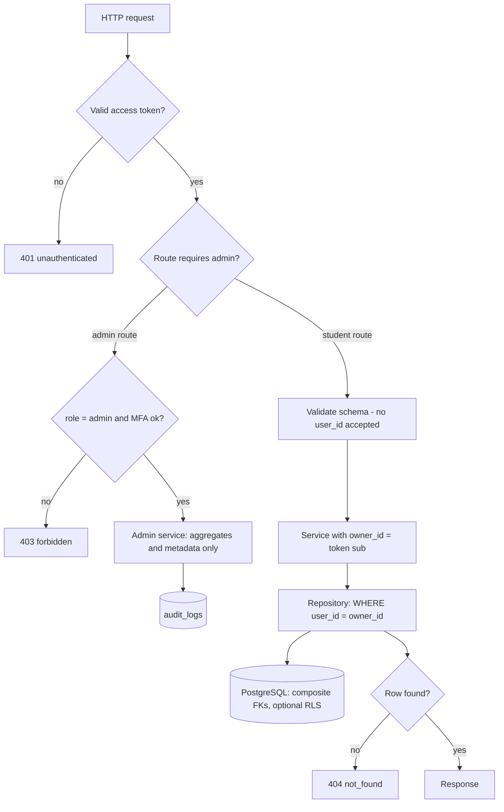

# 08. Authorization

**Purpose:** define who may do what. **Scope:** roles, resource ownership, admin isolation, break-glass access, defense in depth.

See also: [Authentication](07-authentication.md) · [Security](17-security.md) · [Privacy](18-privacy.md) · [Database Design](05-database-design.md#7-data-ownership-rules) · [API Specification](06-api-specification.md)

## 1. Model

Authorization is **RBAC for capability + ownership for data**.

| Role | Capabilities |
|---|---|
| `student` | Full access to **own** data and features |
| `admin` | `/admin/*` endpoints: aggregates, account metadata, job health, audit logs, feature flags, suspend accounts. **No access to student content.** |
| *(future)* `teacher` | Out of scope; would add organisation-scoped sharing ([Future Roadmap](24-future-roadmap.md)) |

An admin account is not also a student with elevated reach: admin credentials use admin endpoints; if the same person studies, they use a separate student account.

## 2. Ownership Enforcement

1. Token subject (`sub`) is the only source of the acting user id.
2. Every repository function for user-owned tables **requires** `owner_id` and always includes `WHERE user_id = :owner_id` (and `deleted_at IS NULL` where applicable). There is no repository method that fetches a user-owned row by id alone.
3. Foreign resources return **404**, not 403, so existence is not disclosed.
4. Child tables carry `user_id` and composite FKs, so a task cannot reference another user's subject even through a bug ([Database Design](05-database-design.md#1-conventions)).
5. Request schemas forbid `user_id` and unknown fields.
6. Background jobs receive `user_id` explicitly and run through the same repositories.
7. **Defense in depth (Phase 19, recommended):** PostgreSQL Row-Level Security policies keyed on `current_setting('app.current_user_id')`, set with `SET LOCAL` per transaction (compatible with transaction-pooled connections). The admin/maintenance database role used by migrations and system jobs is distinct and never used by request handlers.

## 3. Permission Matrix

| Resource | student (owner) | student (other) | admin |
|---|---|---|---|
| Tasks, subtasks, subjects, exams, projects, hackathons, resources, files, study sessions, recommendations, roadmaps, notes | CRUD | 404 | **None** |
| Own profile, settings, consents | Read/update | 404 | Metadata only (status, role, dates) |
| Notifications | Read/mark | 404 | None |
| AI requests (own result) | Read/accept/reject | 404 | Aggregate cost/error only; **no prompts or payloads** |
| Google connection | Manage | 404 | Status counts only |
| Audit logs | None | None | Read (no content fields exist in logs) |
| Feature flags, jobs | None | None | Manage |
| Account suspension | None | None | Yes (audited, reason required) |
| Break-glass support view | Grants consent | n/a | Only with active grant |

## 4. Admin Isolation

- Admin routes live in the `admin` module, which has **no dependency** on content modules' repositories. It reads aggregate queries and metadata views defined for it.
- Admin endpoints never return emails in clear by default (masked `p***@example.edu`); full email requires a break-glass grant.
- Every admin request writes an audit log; audit logs hold ids and action names, never content.
- MFA required for admin (Phase 19); admin sessions are shorter.

### Break-glass (support) access

For rare support cases a student can consent to a time-boxed look at specific diagnostic data.

1. Student gives explicit consent (recorded in `consents` and `admin_access_grants.user_consent_at`).
2. Admin creates a grant: reason, scope `support_view`, expiry ≤ 7 days.
3. While active, a restricted diagnostic view (not raw content tables) is available; every read is audited and visible to the student in their privacy settings.
4. Grant expires or is revoked; access ends immediately.

## 5. Data Ownership and Security Flow

## 6. Other Authorization Rules

- Suspended users: all authenticated calls return 403 `account_suspended`; refresh fails.
- Unverified email: blocked from Google integrations, export and password change until verified.
- Rate limits and AI quotas are authorization-adjacent controls applied per user ([Security](17-security.md#3-rate-limiting)).
- Signed file URLs are issued only after an ownership check and expire in 5 minutes.

## 7. Failure Cases and Tests

| Case | Behaviour |
|---|---|
| Role changed while token alive | Admin routes re-check role from the database; student routes unaffected |
| Missing `owner_id` in a repository call | Fails type checking (required parameter) and lint rule |
| New endpoint without an authorization test | CI check on the route registry fails ([Testing Strategy](19-testing-strategy.md)) |

An automated matrix test iterates every route that takes an `{id}`, creates the resource as user A, and asserts user B receives 404 for GET/PATCH/DELETE.
