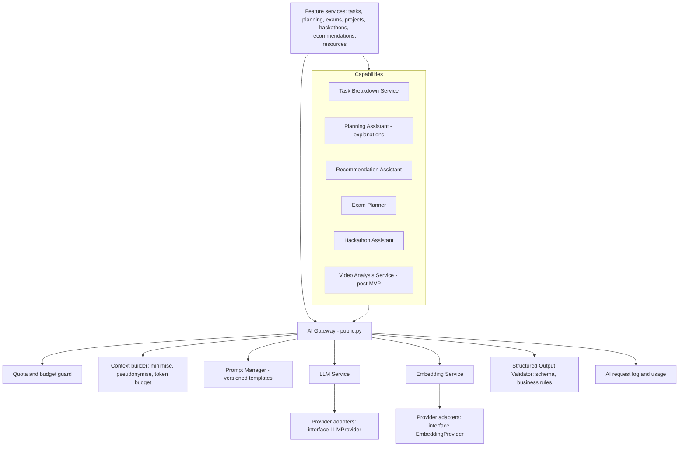
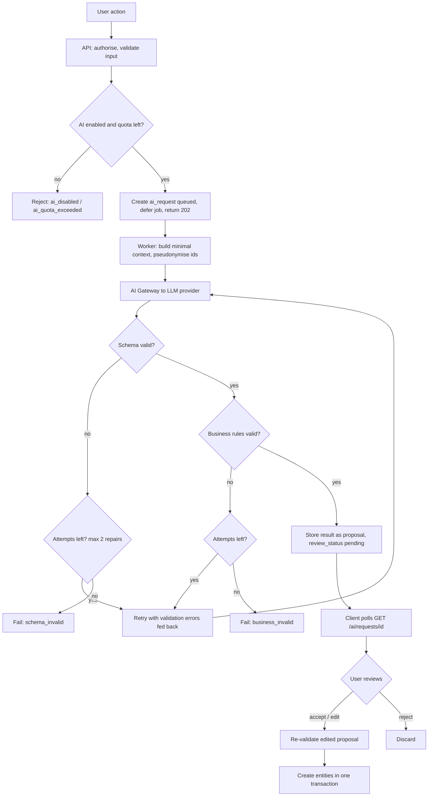
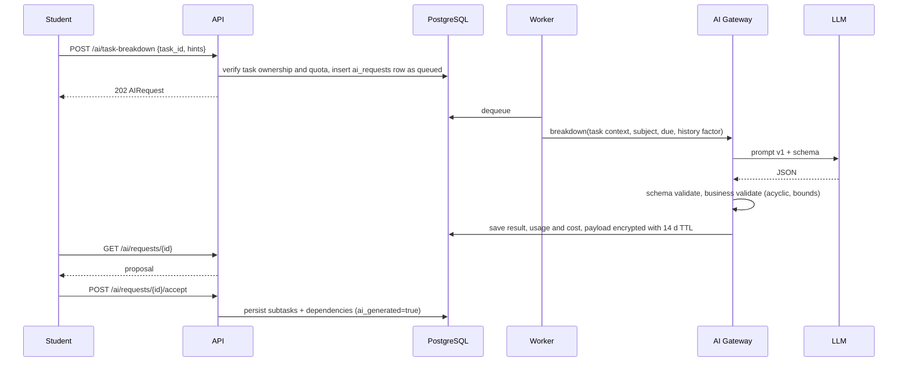

# 09. AI Architecture

**Purpose:** define the centralised AI layer. **Scope:** AI Gateway, providers, prompts, validation, quotas, privacy. The rest of the application never depends on one LLM provider.

See also: [Task Planning Engine](10-task-planning-engine.md) · [Exam Planning Engine](11-exam-planning-engine.md) · [Recommendation Engine](12-recommendation-engine.md) · [Privacy](18-privacy.md) · [Security](17-security.md) · [ADR 008](adr/008-ai-provider-abstraction.md)

## 1. Components

| Component | Responsibility |
|---|---|
| **AI Gateway** | Single entry point: authorisation of use (user enabled AI, quota), context building, call, validation, logging, result persistence |
| **LLM Service** | `generate_structured(request) → raw`, retries on transient errors, timeouts, fallback model chain |
| **Embedding Service** | `embed(texts) → vectors` with the configured model/dimension |
| **Prompt Manager** | Loads versioned prompt files (`prompts/<feature>/v<N>`), renders with typed variables, records version on every request |
| **Structured Output Validator** | Pydantic schema validation then feature-specific business validation |
| **Capability services** | Task Breakdown, Planning Assistant, Recommendation Assistant, Exam Planner, Hackathon Assistant, Video Analysis: each owns its prompt, schema and business rules |

## 2. Provider Abstraction

Interfaces: `LLMProvider.generate(messages, schema, model_tier, max_tokens, timeout) → ProviderResult(text|json, usage)` and `EmbeddingProvider.embed(texts, model) → vectors`. Adapters per vendor (and a deterministic `FakeProvider` for development, tests and CI) are selected by `LLM_PROVIDER`/`EMBEDDING_PROVIDER`. Features request a **logical tier** (`fast`, `standard`, optionally `reasoning`); a config map resolves tier → concrete model per provider. Provider SDK imports are allowed only inside adapters (import-linter contract). Where a provider offers native structured output or tool-call schemas, the adapter uses it; otherwise it uses JSON-mode plus validation. Details of the decision: [ADR 008](adr/008-ai-provider-abstraction.md).

## 3. Critical Flow: Request Validation

**Raw model output is never executed or written to domain tables directly.** Only a validated, user-accepted proposal creates entities, and acceptance re-runs validation on the (possibly edited) payload.

## 4. Task Breakdown Sequence

Output contract (`BreakdownProposal`): `subtasks[]` with `ref`, `title`, `description`, `estimated_minutes`, `depends_on[ref]`, plus `assumptions[]` and `clarifying_questions[]`.

## 5. Business Validation Rules (Task Breakdown)

| Rule | Limit |
|---|---|
| Subtask count | 2–15 |
| Title / description length | ≤ 200 / ≤ 2000 chars, no markup beyond plain Markdown, no URLs not present in the input |
| Estimate per subtask | 5–240 minutes, multiples of 5 |
| Sum of estimates vs task estimate | Within 0.5×–2× if the user gave an estimate; otherwise ≤ 40 h |
| Dependencies | Refs exist, no self-reference, acyclic |
| Duplicates | No two near-identical titles |
| Language | Matches the user's locale |
| Dates | AI never sets dates; scheduling is deterministic ([doc 10](10-task-planning-engine.md)) |

Each capability documents analogous rules in its own doc ([11](11-exam-planning-engine.md), [12](12-recommendation-engine.md)).

## 6. Hallucination and Bad-Estimate Handling

- **Grounding:** prompts include only facts from the student's data; entity references use pseudonymous refs (`T1`, `S3`) mapped back server-side. IDs returned by the model that were not supplied are rejected.
- **No authority:** AI cannot change schedules, priorities, deletions or external systems.
- **Human in the loop:** proposals are reviewed and editable before persistence.
- **Estimates:** AI estimates are labelled `estimate_source=ai`; actual time is tracked and a per-user calibration factor (median actual ÷ estimate, clamped 0.8–2.0) adjusts planning ([doc 10](10-task-planning-engine.md#9-estimate-calibration)); the UI shows confidence ranges rather than false precision.
- **Explanations** produced from engine output must reference only existing items; otherwise a deterministic template built from reason codes is shown instead.

## 7. Prompt Injection and Untrusted Content

Student-authored text, Classroom text, syllabus text, uploaded documents and web content are **data, not instructions**. Controls: wrap in delimited data blocks with an explicit instruction that content inside is untrusted; no tools, no code execution and no network access for the model; output restricted to the schema; length and character caps on each field; strip control characters; reject outputs containing URLs, secrets or instruction-like text not grounded in the input; never place secrets or other users' data in context (context is built per user, per request). Detected injection attempts are logged as metadata and counted.

## 8. Token Management and Model Selection

A context builder assembles inputs under a per-feature token budget, truncating low-value fields first (old history, long descriptions) and summarising where needed. `max_tokens` is set per feature. Tiers: `fast` for classification/explanations/recommendation wording, `standard` for breakdowns and plans, `reasoning` only when evidence shows it improves acceptance rate and cost permits. Fallback chain per feature: preferred model → secondary model/provider → graceful degradation (manual flow or template).

## 9. Cost Tracking, Rate Limiting and Quotas

| Control | Mechanism |
|---|---|
| Per-request cost | `ai_requests.cost_usd` from provider usage × configured price table |
| Per-user quota | Daily request count (`AI_DAILY_REQUEST_LIMIT_PER_USER`, default 30) and token cap via `ai_usage_daily`; `429 ai_quota_exceeded` with reset time |
| Burst limiting | Max 3 concurrent AI requests per user; max 5 requests/min |
| Global budget | `AI_GLOBAL_MONTHLY_BUDGET_USD`: alert at 70% and 90%; at 100% non-essential features (recommendation wording, video analysis) are disabled first, core breakdown stays within a reserved slice |
| Dedupe | Identical in-flight request (same feature + input hash) returns the existing AIRequest |

## 10. Logging and Privacy

Always logged: feature, prompt version, provider, model, status, attempts, tokens, cost, latency, validation error codes, correlation id (no content). Prompt and response bodies are stored only in `ai_request_payloads`, encrypted, with a **14-day TTL**, for debugging and quality review; never shown to admins by default. Data minimisation: no names, emails or institution in prompts; pseudonymous refs; users can disable AI (`ai_features_enabled`) or personalisation. Provider contracts must forbid training on submitted data and, for Google user data (Calendar, Classroom), the Google API Services User Data Policy "Limited Use" requirements must be verified before sending that data to an LLM ([Google Integrations](13-google-integrations.md#7-google-data-and-ai)).

## 11. Failure Handling

| Failure | Handling |
|---|---|
| Provider timeout/5xx | Retry with backoff (2 attempts), then secondary model, then `failed` with `provider_error` |
| Rate-limited by provider | Backoff with jitter; queue delay; circuit breaker opens after repeated failures |
| Invalid structured output | Up to 2 repair retries, then `schema_invalid` |
| Business rule violation | Repair retry with rule feedback, then `business_invalid` |
| Quota exceeded | Immediate 429 before queueing |
| Worker crash | Sweeper re-enqueues `queued`/`running` requests older than 2 / 10 minutes (idempotent by request id) |
| Provider outage | Features degrade: manual subtasks, template explanations; engines unaffected |

## 12. Testing

`FakeProvider` returns scripted valid/invalid/malicious outputs. Required tests: schema validation, every business rule, injection fixtures, retry exhaustion, quota enforcement, accept-time revalidation. A small golden-set evaluation runs nightly against a real provider (not on PRs) to track acceptance-rate proxies and regressions ([Testing Strategy](19-testing-strategy.md#4-ai-tests)).
