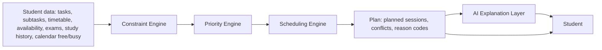
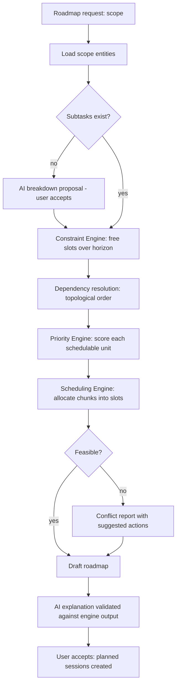

# 10. Task Planning Engine

**Purpose:** specify the deterministic engines that decide what to work on and when. **Scope:** Constraint, Priority and Scheduling engines, task breakdown integration, dependencies, deadlines, available time, conflicts, roadmaps.

**Principle:** the LLM must NOT independently control scheduling decisions. It proposes breakdown content and explains results; engines decide.

See also: [AI Architecture](09-ai-architecture.md) · [Exam Planning Engine](11-exam-planning-engine.md) · [Recommendation Engine](12-recommendation-engine.md) · [Database Design](05-database-design.md#45-planning) · [Backend Architecture](04-backend-architecture.md)

## 1. Pipeline





All engines are **pure functions** over immutable input snapshots (no I/O, no clock reads except an injected `now`), so they are deterministic and unit/property testable. Services load data, call engines, persist results.

## 2. Constraint Engine

Computes available study time per day in the user's timezone, converted to UTC intervals.

```text
free = availability_windows(kind=study)
     − availability_windows(kind=blocked)
     − timetable_entries active on the date (valid_from..valid_until)
     − exams in progress (+ travel buffer 30 min)
     − locked or in-progress planned sessions
     − Google Calendar busy intervals (if connected and enabled)
     − quiet hours
     − past time (before now + 5 min)
then: drop slots shorter than min_block (25 min); cap each day at daily_study_target_minutes.
```

DST: wall-clock windows are expanded per local date using the IANA zone, so 18:00 stays 18:00 across transitions. If no availability is configured, a default (weekdays 18:00–21:00, weekends 10:00–13:00) is used and flagged `default_availability` in the output.

## 3. Priority Engine

Score ∈ [0, ~1.1] per schedulable unit (task with no subtasks, or subtask); higher is more urgent. Weights are configuration constants covered by tests.

```text
slack_hours = available_hours_before_deadline − remaining_estimate_hours × calibration
urgency     = overdue ? 1.0 : 1 / (1 + max(slack_hours, 0) / 24)
importance  = mean of: user_priority/4, exam_weightage/100 (if exam-linked),
              credits/ max_credits (if subject), goal_alignment (0 or 1)
unblock     = min(dependents_count, 5) / 5
aging       = min(days_since_created, 14) / 14   (only if no due date)
score = 0.40·urgency + 0.25·importance + 0.15·unblock + 0.10·aging + 0.10·fit
fit   = 1 − |remaining_estimate − typical_session_length| / max(...)   (favour doable chunks)
overdue bonus: +0.10
blocked units: excluded until dependencies done
```

Every score carries **reason codes** (`DEADLINE_SOON`, `OVERDUE`, `HIGH_WEIGHTAGE_EXAM`, `UNBLOCKS_OTHERS`, `GOAL_ALIGNED`, `QUICK_WIN`, `AGING`) used by explanations and recommendations. Ties break by earliest due date, then lowest id (stable ordering).

## 4. Scheduling Engine

Algorithm (forward fill with deadline awareness):

1. Remaining work per unit = estimate × calibration (default estimate 60 min if missing, flagged `missing_estimate`).
2. Topologically order units by dependencies; within the ready set, order by earliest deadline first, then priority score.
3. Split work into **session chunks** of 25–90 minutes (default 50), respecting `min_block`.
4. Place chunks in the earliest free slot that (a) starts after all dependency chunks end, (b) leaves a ≥ 10-minute break between sessions, (c) does not exceed the daily cap, (d) ends before the deadline minus a 10% buffer when possible.
5. Spread: avoid assigning more than 4 consecutive hours; prefer different subjects within a day when scores are within 5%.
6. **Feasibility check:** if chunks remain after deadline, record a `deadline_infeasible` conflict and place remaining chunks after the deadline marked `late`; never silently drop work.
7. Locked sessions are fixed inputs; unlocked future sessions are recomputed on replan; completed/past sessions are never moved.

Determinism: same snapshot ⇒ same plan (golden-file tests and Hypothesis property tests: no overlaps, never inside blocked time, dependency order respected, total allocated ≤ demand).

## 5. Task Breakdown Integration

The Task Breakdown Service (AI) produces a proposal; once accepted it becomes ordinary subtasks and dependencies. The engines then treat subtasks like any other unit. Estimates from AI are inputs, never truth; calibration corrects them over time.

## 6. Dependency Resolution

Task-level and subtask-level dependency graphs are DAGs. On every write the service runs cycle detection (DFS/Kahn) in the same transaction and rejects with `409 dependency_cycle`. A unit is **blocked** if any dependency is not `done`/`cancelled`. Cancelling a dependency unblocks dependents. Deleting a task removes its dependency edges and recomputes blocked state. Cross-task dependencies are honoured when ordering chunks across tasks.

## 7. Deadline Handling

`due_at` is a hard target for planning; exams and hackathon submission deadlines are hard. Past-due items are scheduled first with `OVERDUE`. Tasks without due dates are scheduled opportunistically in leftover capacity by aging score. Soft vs hard deadlines are not distinguished in MVP (see review M-15).

## 8. Available Time Calculation

Total capacity for a horizon is the sum of free slots after the Constraint Engine. Demand is the sum of remaining estimates × calibration. The ratio `demand / capacity` drives the overload conflict and the dashboard "load" indicator (< 0.7 comfortable, 0.7–1.0 tight, > 1.0 overloaded).

## 9. Estimate Calibration

Per user (and per subject when ≥ 5 samples): `calibration = clamp(median(actual_minutes / estimated_minutes), 0.8, 2.0)` over the last 20 completed tasks with both values; default 1.2 for new users (planning fallacy buffer). Computed by the analytics module and consumed through its public interface.

## 10. Conflict Detection

| Code | Detected when | Suggested actions |
|---|---|---|
| `overload` | demand/capacity > 1.0 for a week | Add availability, extend deadlines, drop or defer low-priority tasks |
| `deadline_infeasible` | chunks cannot finish before a deadline | Extend deadline, reduce scope, add hours before date |
| `fixed_overlap` | timetable/exam/locked sessions overlap | Edit entries |
| `dependency_cycle` | graph has a cycle (legacy data) | Remove an edge |
| `missing_estimate` | unit has no estimate | Add estimate or accept default |
| `past_due` | due date passed, not done | Reschedule or cancel |

## 11. Replanning

Triggers: task/subtask created, edited, completed; session missed or finished; availability, timetable or exam changes; Calendar free/busy changes; daily 04:00 local; manual replan. Replans are debounced (30 s) and run as a job so storms (for example bulk Classroom import) coalesce into one run per user. Missed sessions (end passed without a linked study session) become `missed` and their work returns to the pool.

## 12. AI Explanation Layer

Input: engine output (ordered units, reason codes, conflicts, numbers). The LLM writes a short natural-language explanation ("Start with X because its deadline leaves little slack and it unblocks Y"). Validation: it may reference only supplied items and numbers; otherwise fall back to template text per reason code. The explanation cannot alter the plan.

## 13. "What should I work on now?"

`GET /planner/now` reads the active plan: the current/next planned session if one is due within 15 minutes, else the highest-scoring ready unit that fits remaining free time today, with reason codes and explanation.

## 14. Failure Cases

| Failure | Behaviour |
|---|---|
| No availability data | Defaults applied and flagged |
| Calendar free/busy unavailable | Plan without it, flag `freebusy_stale` |
| Engine exception | 500 for sync paths; job retry for async; previous active plan stays |
| Explanation fails validation | Template explanation |
| Stale inputs at accept | 409 `stale_inputs` (inputs hash changed) → regenerate |
