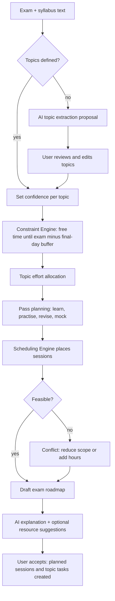

# 11. Exam Planning Engine

**Purpose:** generate exam-preparation roadmaps. **Scope:** MVP basic exam roadmap and the post-MVP advanced planner. It reuses the Constraint and Scheduling engines.

See also: [Task Planning Engine](10-task-planning-engine.md) · [AI Architecture](09-ai-architecture.md) · [Database Design](05-database-design.md#46-exams-projects-hackathons) · [API Specification](06-api-specification.md#47-exams)

## 1. Inputs

Exam (date, duration, weightage, subject), topics (confidence 1–5, optional estimate), syllabus notes, available time until the exam (Constraint Engine), existing tasks linked to the exam, study history for the subject (calibration), user settings.

## 2. Flow



## 3. Effort Allocation (deterministic)

```text
budget_minutes = min(capacity_until_exam × 0.85, exam_prep_cap)      # keep 15% slack; cap default 40 h per exam
need_i = (6 − confidence_i) × difficulty_weight_i × topic_estimate_i   # difficulty_weight default 1.0
share_i = need_i / Σ need
topic_minutes_i = round_to_5(budget_minutes × share_i), minimum 30 min per topic
```

If the sum of minimums exceeds the budget, emit `deadline_infeasible` and allocate proportionally with a conflict note. Topics with confidence 5 receive one revision pass only.

## 4. Pass Structure

| Pass | Share of topic time | Placement rule |
|---|---|---|
| Learn | 45% | Earliest slots, ordered by confidence ascending |
| Practise (problems, past papers) | 30% | After Learn for the topic |
| Revise 1 | 10% | ≥ 2 days after Learn when time permits |
| Revise 2 (spaced) | 10% | 1–3 days before exam |
| Mock test (full-length, if duration known) | one block of `duration_minutes` | ≥ 2 days before exam, once per exam > 20% weightage |

Final 24 hours: revision only, low-confidence topics first; no new topics. Topic status updates (`studying`, `revised`) and confidence changes after sessions trigger a replan.

## 5. AI Role and Validation

AI may (a) extract topics from syllabus text (2–40 topics, titles ≤ 120 chars, no duplicates, no invented topics outside the text; user reviews), (b) suggest estimated effort and difficulty hints as proposals, (c) explain the roadmap, (d) suggest resource types or search phrases (post-MVP: concrete links only from the user's own resources or a vetted source). AI never sets dates or hours that bypass the engine.

## 6. Post-MVP: Advanced Exam Planner

Adaptive confidence from practice results, spaced-repetition scheduling per topic, multi-exam conflict balancing across a shared exam week, past-paper difficulty modelling, and mock-test analytics. These extend the same inputs and are listed in [Future Roadmap](24-future-roadmap.md).

## 7. Failure Cases

| Case | Behaviour |
|---|---|
| Exam in the past | 409 on roadmap request |
| Less than 24 h until exam | Revision-only roadmap with a warning |
| No topics and extraction fails | 422 with guidance to add topics manually |
| Multiple exams overlapping preparation windows | Priority Engine arbitrates by weightage and proximity; conflicts surfaced |
| Exam rescheduled | Replan job; accepted roadmap marked `superseded` and a new draft proposed |
