# 12. Recommendation Engine

**Purpose:** produce explainable, actionable recommendations. **Scope:** MVP "basic AI recommendations", post-MVP advanced and adaptive layers.

See also: [Task Planning Engine](10-task-planning-engine.md) · [AI Architecture](09-ai-architecture.md) · [Privacy](18-privacy.md) · [Database Design](05-database-design.md#48-recommendations-resources-files-notifications) · [Future Roadmap](24-future-roadmap.md)

## 1. Architecture

```mermaid
flowchart LR
  subgraph Candidates
    G1[Next best task - from planner]
    G2[Overdue rescue]
    G3[Exam prep nudge]
    G4[Subject balance]
    G5[Break suggestion]
    G6[Resource suggestion - pgvector]
  end
  Data[Planner state, analytics, study sessions, resources] --> Candidates
  Candidates --> Filter[Eligibility, dedupe, cooldown]
  Filter --> Rank[Deterministic ranking score]
  Rank --> Cap[Cap: max 5 active]
  Cap --> Word[AI wording and explanation - validated]
  Word --> Store[(recommendations)]
  Store --> UI[Dashboard / notifications]
  UI --> FB[Accept / dismiss feedback]
  FB --> Rank
```

Generation is deterministic and rule-based; AI only improves wording and personalisation of the *explanation*. A recommendation is never created from free-form model output.

## 2. Generators (MVP)

| Kind | Trigger | Basis |
|---|---|---|
| `next_task` | Dashboard load / nightly | Highest Priority Engine score that fits free time |
| `overdue_rescue` | Overdue items exist | Suggest smallest overdue chunk first |
| `exam_prep` | Exam within 14 days and topics under-covered | Topic coverage vs roadmap |
| `subject_balance` | A subject has received < 50% of its planned time over 7 days | Planned vs actual by subject |
| `break` | ≥ 3 consecutive focus hours or daily target exceeded | Neutral wording ("a break may help you stay consistent"); no health claims |
| `resource` | Task/exam in a subject with saved resources | pgvector similarity between task text and the user's own resources |

## 3. Ranking

`score = 0.5·impact + 0.2·timeliness + 0.2·personal_fit + 0.1·novelty`, where impact derives from engine priority/reason codes, timeliness from deadlines and time of day, personal_fit from past accept/dismiss rates per kind and the user's `ai_personalization_enabled` flag, and novelty penalises repeats. Dismissed items get a cooldown (kind-specific, default 3 days). Cold start: only impact and timeliness.

## 4. Lifecycle

`new → seen → accepted | dismissed | expired`. Each has `reason` (required, human-readable) and `reason_codes`. `dedupe_key` (kind + subject entity + date bucket) prevents duplicates. Accepting `next_task` can start a Pomodoro session or create a planned session. Refresh: nightly job, on significant data change (debounced), or manual (rate-limited to once per 10 minutes).

## 5. Productivity Analytics vs Health

Recommendations speak about **study behaviour and planning**, never about mental or physical health. Prohibited: diagnostic or evaluative language (burnout, anxiety, depression, attention disorders), sleep or medical advice. See [Privacy](18-privacy.md#productivity-analytics-are-not-health-diagnosis).

## 6. AI Validation

Wording requests return `{title ≤ 80 chars, body ≤ 300 chars, reason ≤ 200 chars}` and are rejected if they reference unknown entities, contain URLs, or use disallowed health-related terms (blocklist + tests); fallback is a template per kind.

## 7. Post-MVP and Future

Advanced recommendations (contextual bandit over kinds and timing), hackathon recommendations (needs a data source, see review M-09), AI news feed (embedding match against interests and goals; source licensing, review M-10), YouTube learning suggestions, then ML recommender trained on aggregated, consented data ([Future Roadmap](24-future-roadmap.md)).

## 8. Failure Cases

| Case | Behaviour |
|---|---|
| No data (new user) | Onboarding-driven starter recommendations (add first subject/task) |
| AI wording fails | Template wording; recommendation still created |
| Embedding service down | Skip `resource` kind |
| Too many dismissals of one kind | Reduce that kind's frequency; surface a setting to mute it |
