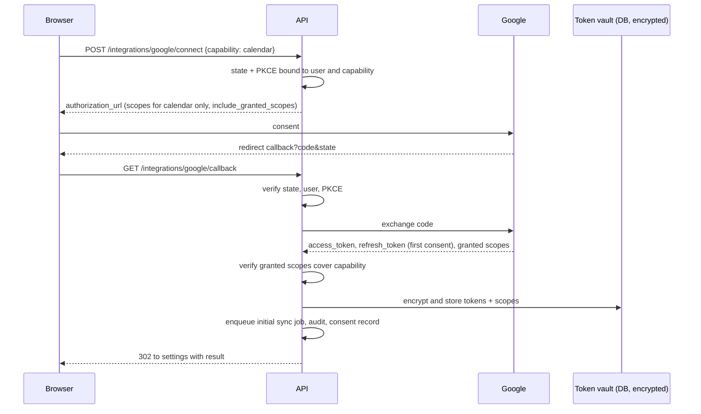
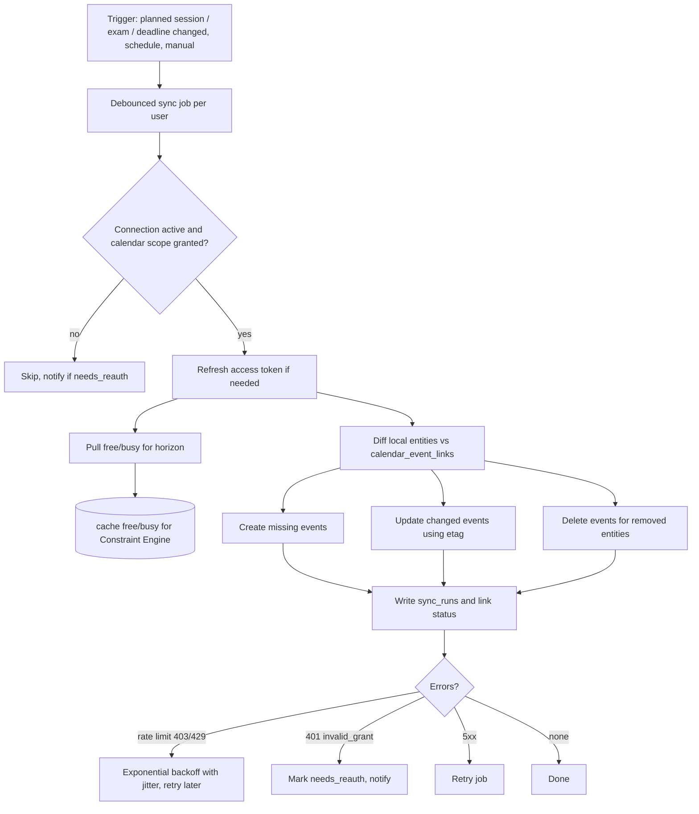
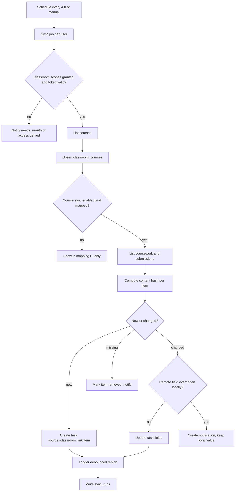

# 13. Google Integrations

**Purpose:** define Google OAuth, Calendar, Classroom and (post-MVP) Drive integration. **Scope:** scopes, incremental authorization, token lifecycle, sync, errors, policy risks.

> **Verification rule:** Google API behaviour below is written from general knowledge and is **not guaranteed current**. Every item marked **[VERIFY]** must be checked against official Google documentation (OAuth scopes list, Calendar API, Classroom API, API Services User Data Policy, OAuth verification requirements) before implementation. Do not implement a [VERIFY] item from this document alone.

See also: [Authentication](07-authentication.md) · [Security](17-security.md) · [Privacy](18-privacy.md) · [Task Planning Engine](10-task-planning-engine.md) · [Database Design](05-database-design.md#410-google-integration) · [ADR 007](adr/007-google-oauth.md)

## 1. Capabilities and Scopes

| Capability | Tier | Scopes (candidate) | Sensitivity | Notes |
|---|---|---|---|---|
| Sign-in | MVP | `openid`, `email`, `profile` | Non-sensitive | Identity only ([doc 07](07-authentication.md)) |
| Calendar write + free/busy | MVP | Preferred narrow set: `calendar.app.created` (dedicated calendar) + `calendar.freebusy` **[VERIFY availability and sufficiency]**; fallback `calendar.events` | Sensitive | Narrow scopes reduce review burden and user risk |
| Classroom (student, read-only) | MVP | `classroom.courses.readonly`, `classroom.coursework.me.readonly`, `classroom.student-submissions.me.readonly` **[VERIFY exact names and classification]** | Sensitive/restricted **[VERIFY]** | Pull only |
| Drive import | Post-MVP | `drive.file` with Google Picker (per-file access) **[VERIFY]** | Non-restricted compared with full Drive | **Never** request full `drive` or `drive.readonly` |

Principle: request the narrowest scope that delivers the feature, at the moment the user enables it.

## 2. Incremental Authorization

Sign-in requests only identity scopes. When the user turns on Calendar, Classroom or Drive in Settings, `POST /integrations/google/connect {capability}` builds an authorization URL for **only that capability's scopes** with `include_granted_scopes=true`, `access_type=offline`, PKCE and state. On callback the backend reads the **granted** scopes from the token response (users can untick scopes **[VERIFY consent-screen behaviour]**), stores them, and enables only capabilities whose required scopes are all present; partial grants surface a clear message and an option to retry.

## 3. Token Lifecycle

| Stage | Handling |
|---|---|
| Storage | Refresh and access tokens encrypted with AES-256-GCM using `TOKEN_ENCRYPTION_KEY` (key id stored for rotation; migrate to a KMS-backed envelope key in production); never logged |
| Access token | Short-lived (about an hour **[VERIFY]**); refreshed on demand by the sync client under a per-user lock |
| Refresh token | Usually issued on first consent with offline access; if missing on reconnect, force re-consent **[VERIFY prompt behaviour]**; rotate if Google returns a new one |
| Expiry/invalid | `invalid_grant` ⇒ connection `needs_reauth`, sync paused, notification sent; planner proceeds without free/busy |
| Revocation | User revokes in Google account → next call fails → `needs_reauth`/`revoked`. User disconnects in app → call Google's revoke endpoint **[VERIFY]**, delete tokens, delete `calendar_event_links` (events optionally removed from the dedicated calendar), disable syncs |
| Testing-mode apps | Apps in Google's "Testing" publishing status may get short-lived refresh tokens **[VERIFY]**; plan for production verification before real users |
| Account deletion | Revoke tokens, delete connection and mappings ([Privacy](18-privacy.md)) |

## 4. Google Calendar Synchronisation

Design (one-way push, free/busy pull):

- Create a dedicated **"StudentOS"** secondary calendar and write events there; never modify the user's other calendars. If only `calendar.events` is available, still write only to the dedicated calendar.
- **Push:** planned sessions, exams, task deadlines and hackathon deadlines (per user toggles) → events. Mapping stored in `calendar_event_links` (entity ↔ `google_event_id`, `etag`).
- **Pull:** free/busy intervals for the horizon (14 days) feed the Constraint Engine. Event titles from other calendars are never read in MVP.
- **Source of truth:** StudentOS. If a user edits or deletes a StudentOS-created event in Google, mark the link `externally_modified` / `deleted_remote` and surface it in the planner; MVP does not apply remote edits back.
- Idempotency: events created with a deterministic client-supplied id derived from the entity id **[VERIFY id rules]** or looked up through the link table; retries never duplicate.
- Triggers: entity change events → debounced sync job per user; scheduled poll every 15 min for free/busy; manual sync.
- Incremental changes via sync tokens with full resync on `410 Gone` **[VERIFY]**; push-notification channels (webhooks) are post-MVP (channels expire and need renewal **[VERIFY]**).

## 5. Google Classroom Synchronisation

Read-only pull for the student's own courses and coursework.

- **Courses:** list active courses; user confirms mapping of each course to an existing or new Subject and enables sync per course (`classroom_courses`).
- **Coursework:** import items with due dates as tasks (`source='classroom'`, linked via `classroom_items.task_id`); title, due date, state and submission state are remote-controlled fields.
- **Local edits:** user-owned fields (priority, estimate, subtasks, notes) are never overwritten. If the user edits a remote-controlled field, record it in `overridden_fields`; later remote changes to that field produce a notification instead of overwriting.
- **Completion:** submission state `TURNED_IN`/returned maps to a suggestion to complete the task, not an automatic completion **[VERIFY state names]**.
- **Removals:** items archived, deleted or no longer visible are marked, not deleted; the user decides.
- **Frequency:** every 4 hours (jittered) plus manual sync; per-user sync lock.
- **Limits:** Workspace for Education administrators may block third-party apps or restrict API access; handle `403` access-denied with an explanatory message **[VERIFY]**.

## 6. Google Drive (Post-MVP)

Use Google Picker with `drive.file` so StudentOS only accesses files the user explicitly selects **[VERIFY]**. Selected files are copied into object storage after validation ([File Storage](16-file-storage.md)) or referenced; never request broad Drive scopes.

## 7. Google Data and AI

Google API Services User Data Policy requirements (including "Limited Use") apply to data obtained via restricted/sensitive scopes **[VERIFY current text]**. Implications designed in: use Google data only to provide user-facing features; no advertising use; no transfer except as needed for those features or required by law; no human reading without consent except for security/legal; **do not use Google user data to train generalised AI/ML models**, and sending Classroom or Calendar-derived text to an LLM requires a provider agreement that prohibits training and retention beyond processing, plus disclosure in the privacy policy. Prompts built from Classroom items contain only titles and due dates needed for the feature, pseudonymised.

## 8. Errors and Quotas

| Condition | Handling |
|---|---|
| 401 / `invalid_grant` | `needs_reauth`, pause, notify |
| 403 access denied / admin policy | Explain; offer disconnect |
| 403 `rateLimitExceeded` / 429 | Exponential backoff with jitter, honour `Retry-After`; per-user and global limiters |
| 404 for linked event/course | Mark remote deleted; do not recreate without user action |
| 5xx / network | Retry with backoff; `sync_runs.status=partial/failed` |
| Quota exhaustion | Lower polling frequency globally; alert |
| Unexpected response shape | Validate with schemas; skip item; log metadata only |

All Google responses are validated before use; no raw Google payloads are persisted beyond mapped fields.

## 9. Production Requirements

OAuth consent screen configured for production; sensitive-scope **verification submitted early** (lead time is outside our control; start at Phase 13); privacy policy URL and limited-use disclosure; domain verification; redirect URIs exact-match per environment; separate Google Cloud projects for staging and production. See review items G-01..G-08 in [Architecture Review](25-architecture-review.md).
