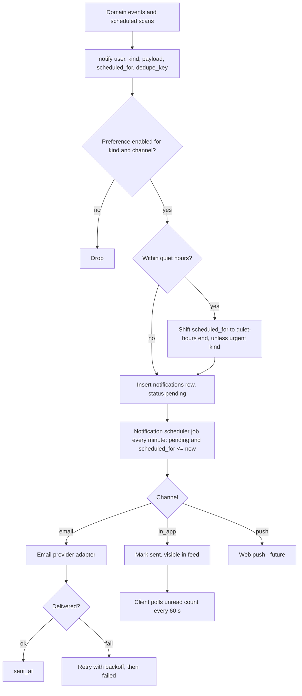

# 14. Notification System

**Purpose:** define how students are notified. **Scope:** MVP in-app notifications; post-MVP email and push.

See also: [Backend Architecture](04-backend-architecture.md#7-background-jobs) · [Database Design](05-database-design.md#48-recommendations-resources-files-notifications) · [API Specification](06-api-specification.md#415-notifications) · [Privacy](18-privacy.md) · [Task Planning Engine](10-task-planning-engine.md)

## 1. Notification Kinds

| Kind | Source event | Default channels |
|---|---|---|
| `session_starting` | Planned session starts in 10 min | in-app |
| `deadline_approaching` | Task due in 24 h and 3 h, not done | in-app (email post-MVP) |
| `exam_upcoming` | Exam in 7 d, 2 d, 1 d | in-app (email post-MVP) |
| `plan_conflict` | Replan finds a new conflict | in-app |
| `sync_attention` | Google `needs_reauth`, Classroom override conflict, sync failures | in-app (email post-MVP) |
| `recommendation` | New high-score recommendation | in-app (opt-in) |
| `export_ready`, `deletion_scheduled` | Privacy flows | in-app + email |
| `achievement` | Gamification (post-MVP) | in-app |

Security emails (verification, password reset, password changed) are transactional and bypass preferences; they are not notifications.

## 2. Flow

## 3. Rules

- **Dedupe:** unique `(user_id, dedupe_key, channel)`, for example `deadline:{task_id}:24h`. Replans update or cancel pending notifications whose underlying entity changed (job checks entity state at send time, so completed tasks never notify).
- **Preferences:** per kind and channel in `notification_preferences`; defaults above; users can disable any non-critical kind.
- **Quiet hours:** from `user_settings` in the user's timezone; `plan_conflict` and security events are not suppressed.
- **Rate limit:** max 10 notifications per user per day for non-critical kinds; batch similar items ("3 deadlines tomorrow").
- **Content:** titles and bodies avoid sensitive detail (no full task descriptions) in email channels.
- **Delivery in MVP:** in-app feed polled every 60 s through TanStack Query; server-sent events are a later optimisation.

## 4. Scheduler Design

A periodic job scans `notifications WHERE status='pending' AND scheduled_for <= now()` using the partial index, locks rows with `FOR UPDATE SKIP LOCKED`, processes in batches of 200, and records outcomes. Scheduled-event generators (deadline/exam/session scans) run every 5 minutes and insert future-dated notifications idempotently.

## 5. Post-MVP

Email notifications and daily digest through an email provider adapter (same abstraction as transactional email), unsubscribe links, web push, and per-channel quiet hours.

## 6. Failure Cases

| Case | Behaviour |
|---|---|
| Email provider outage | Retry with backoff up to 24 h, then `failed`; in-app copy still present |
| Scheduler downtime | Backlog processed on recovery; notifications older than 6 h for time-sensitive kinds are expired instead of sent |
| Duplicate generation | Prevented by dedupe key |
| User deletes account | Pending notifications deleted with the user (cascade) |
