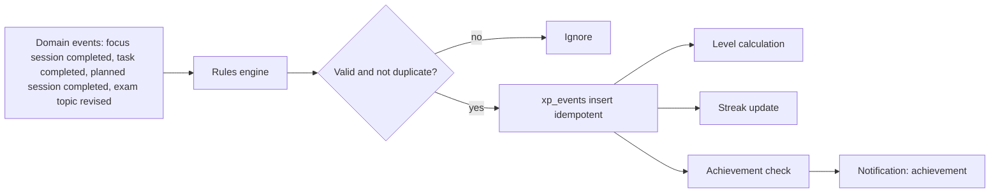

# 15. Gamification (Post-MVP)

**Purpose:** design motivational mechanics that reinforce healthy study habits. **Scope:** XP, levels, streaks, achievements. Not part of the MVP; the schema is introduced in roadmap Phase 17.

See also: [Recommendation Engine](12-recommendation-engine.md) · [Privacy](18-privacy.md) · [Database Design](05-database-design.md#49-gamification-post-mvp) · [Development Roadmap](23-development-roadmap.md) · [Future Roadmap](24-future-roadmap.md)

## 1. Principles

Reward consistent effort, not raw hours; never shame; no public leaderboards in this phase (social features are future); opt-out available; derived from verified events only; wording stays about study habits, never health.

## 2. Event Flow

## 3. Rules

| Event | XP | Anti-gaming limit |
|---|---|---|
| Completed focus cycle (≥ 20 min) | 10 per cycle | Max 12 cycles/day count |
| Task completed | 5 + priority bonus (0–6) | Tasks completed < 2 min after creation award 0 |
| Planned session completed on time | 15 | Once per planned session |
| Exam topic moved to `revised` | 8 | Once per topic per pass |
| Weekly plan adherence ≥ 80% | 50 | Once per week |

Level thresholds grow gradually (`xp_for_level(n) = 100·n^1.5`, rounded). **Streak:** consecutive local days with ≥ 1 completed focus cycle or completed planned session; one "freeze" per week prevents loss from a missed day; resets are quiet (no negative notification).

## 4. Achievements (initial catalogue)

First task, first week streak, 10 planned sessions completed, exam prep finished on schedule, first accepted AI breakdown, 5 projects/hackathon milestones completed. Criteria are declarative JSON evaluated by the rules engine.

## 5. Idempotency and Integrity

`xp_events` has a unique key on `(user_id, event_type, source_type, source_id)`, so replays and retries never double-award. XP and streaks are derived and can be rebuilt from source events. Deleting a task or session does not revoke awarded XP (avoids surprise changes) but deleting an account removes everything.

## 6. Privacy

Gamification state is private to the user. Aggregate engagement metrics for admins are anonymous counts only.

## 7. Failure Cases

| Case | Behaviour |
|---|---|
| Out-of-order events | Streak computed from dates in the user's timezone, order-independent |
| Timezone change | Streak days recomputed from stored UTC timestamps |
| Abuse patterns (rapid fake sessions) | Caps above; suspicious accounts flagged in aggregate metrics only |
