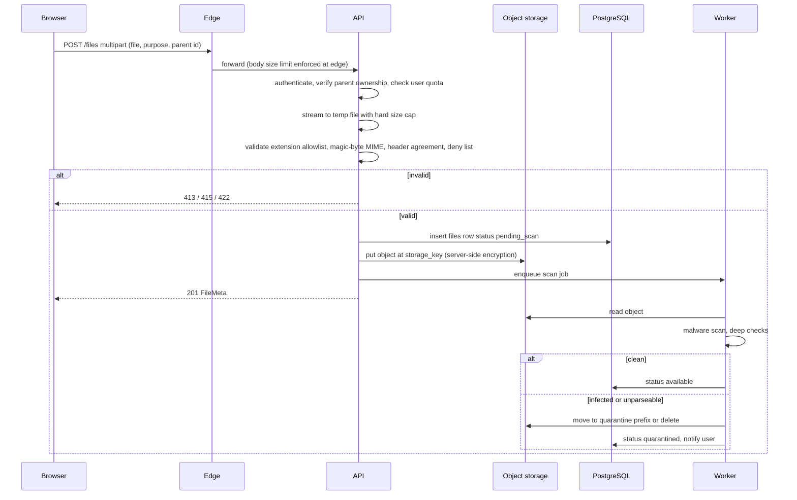

# 16. File Storage

**Purpose:** define upload, storage, access and deletion of student files. **Scope:** PDF, PPT(X), DOC(X), images and hackathon files. Files are never stored in PostgreSQL; only metadata is.

See also: [Security](17-security.md#6-file-upload-security) · [Privacy](18-privacy.md) · [Database Design](05-database-design.md#48-recommendations-resources-files-notifications) · [API Specification](06-api-specification.md#413-resources-and-files) · [ADR 010](adr/010-object-storage.md)

## 1. Architecture

```text
Frontend → Backend → Upload Validation → Object Storage
                                  ↓
                         Metadata → PostgreSQL
```

## 2. Upload Flow



## 3. Validation Rules

| Rule | Value |
|---|---|
| Max size per file | 25 MiB (`UPLOAD_MAX_BYTES`), enforced at edge and streaming in API |
| Per-user quota | 1 GiB total, 200 files (architectural recommendation) |
| Allowed types | `.pdf`, `.ppt`, `.pptx`, `.doc`, `.docx`, `.png`, `.jpg`/`.jpeg`, `.webp`, `.txt`, `.md` |
| Rejected | Executables and scripts, archives (`.zip` etc.) in MVP, macro-enabled Office (`.docm`, `.pptm`), **SVG** (script-capable), HTML, double extensions with dangerous final segment |
| MIME validation | Detect type from magic bytes (not the client `Content-Type`); the detected type must agree with the extension and the declared header; store the **detected** type |
| Filename | Sanitised for display only (strip path separators, control characters, limit 150 chars); never used in the storage key |
| Parent | Exactly one of subject, task, project, hackathon; ownership verified |
| Deep checks (worker) | PDF structure parse without executing, Office container sanity (zip bomb ratio, entry count), image decode and re-encode check, malware scan (ClamAV or managed scanning service) |

## 4. Storage Keys and Layout

`users/{user_id}/files/{file_id}` (opaque, random UUID, no user-controlled text). Prefixes `quarantine/` and `exports/{user_id}/{export_id}` are separate. Bucket is **private** with block-public-access, server-side encryption, versioning off (deletes must be real), lifecycle rule to expire `exports/` after 7 days and abort incomplete multipart uploads after 1 day.

## 5. Access Control and Signed URLs

Download: `GET /files/{id}/download-url` verifies ownership and `status='available'`, then returns a pre-signed GET URL valid for **5 minutes** with `response-content-disposition: attachment` and `response-content-type` fixed to the stored detected type. Responses served through the CDN or storage carry `X-Content-Type-Options: nosniff`. URLs are not logged. Images shown in-app use short-lived signed URLs as well. Files are never served from the application's origin, to avoid same-origin script execution.

## 6. Deletion

User delete → soft delete (`deleted_at`, status `deleted`, URL issuance stops immediately). Purge job after 30 days deletes the object then the row; account deletion deletes all objects within the deletion window. A reconciliation job lists objects and rows to remove orphans in either direction (storage object without row older than 24 h; row `available` without object → flagged). Backups of the database do not contain file bytes.

## 7. Data Export

Export bundles are written to `exports/…`, registered as `files` with `purpose='export'`, delivered via signed URL, and expire after 7 days ([Privacy](18-privacy.md)).

## 8. Failure Cases

| Failure | Handling |
|---|---|
| Storage put fails after DB insert | Transaction rolled back or row marked `failed`; client retry with idempotency key |
| Process dies after storage put | Reconciliation removes orphan |
| Scan service unavailable | Files stay `pending_scan` (not downloadable); retry; alert if backlog > 15 min |
| Client aborts upload | Temp file removed; no row |
| Storage outage | 503 `upstream_unavailable` for uploads/downloads only |
| Oversized body | 413 at edge before reaching the app |

## 9. Future

Direct-to-storage pre-signed POST uploads with post-upload validation (removes API bandwidth load; migration path in [ADR 010](adr/010-object-storage.md)), image thumbnails, text extraction for search, Drive import.
