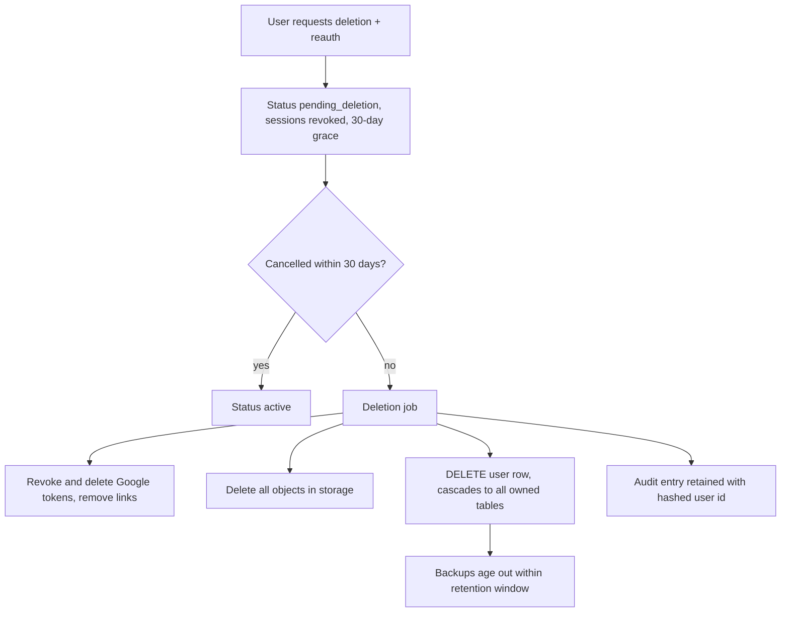

# 18. Privacy

**Purpose:** define how student data is owned, used, exported and deleted. **Scope:** data inventory, consent, rights, retention, Google and AI data handling. Legal obligations (for example GDPR, India's DPDP Act 2023, children's data rules) must be **verified with qualified counsel** before launch; this document defines technical behaviour, not legal advice.

See also: [Security](17-security.md) · [Authorization](08-authorization.md) · [AI Architecture](09-ai-architecture.md#10-logging-and-privacy) · [Google Integrations](13-google-integrations.md#7-google-data-and-ai) · [Database Design](05-database-design.md) · [File Storage](16-file-storage.md)

## 1. Principles

Students own their data. Collect only what features need. Administrators do not see private content by default. AI providers receive the minimum, pseudonymised context. Every integration is optional, consent-based and revocable. Analytics describe study behaviour, not health.

## 2. Data Inventory

| Category | Examples | Purpose | Retention |
|---|---|---|---|
| Account | Email, password hash, Google subject | Authentication | Until deletion |
| Profile | Name, institution, degree, interests, goals | Personalisation | Until deletion |
| Academic content | Subjects, tasks, notes, exams, projects, hackathons, files | Core features | Until user deletes or account deleted; soft-deleted items purged after 30 days |
| Execution data | Study sessions, Pomodoro cycles, daily stats | Planning, analytics | Until deletion |
| Google data | Calendar free/busy and created-event mappings; Classroom courses/coursework metadata; tokens | Sync features | Until disconnect/deletion; tokens deleted on disconnect |
| AI metadata | Feature, tokens, cost, status | Quotas, cost, quality | 12 months (no content) |
| AI payloads | Encrypted prompt/response | Debugging | **14 days** |
| Security logs | Audit logs, login attempts (hashed identifiers) | Security | Audit 12 months; login attempts 30 days |
| Operational logs | Structured logs without content/PII | Operations | 30 days |
| Third-party names | Hackathon teammate names/contacts typed by the user | Workspace | With the hackathon; user warned to enter only what teammates agree to |

## 3. Consent

Recorded in `consents` (type, version, granted, timestamp): Terms, Privacy Policy, AI processing, Google Calendar, Google Classroom, Google Drive (post-MVP), optional analytics. AI processing consent is requested during onboarding and can be turned off (`ai_features_enabled`), which disables AI features while deterministic planning continues. Withdrawal is as easy as granting. Consent versions are bumped when purposes change and re-requested.

Age: the product targets college students. A minimum age (recommended 18, or 16 with local-law review) must be defined and enforced at registration; under-age handling needs legal review (review M-08).

## 4. Data Export

`POST /users/me/export` creates an async job producing a ZIP: JSON files per module (profile, subjects, tasks, subtasks, exams, projects, hackathons, study sessions, resources, notifications, recommendations, settings, consents) plus uploaded files. Delivered through a signed URL, expiring in 7 days; secrets, tokens and other users' data are excluded. Requires verified email and a recent login.

## 5. Account Deletion

Backups containing deleted data expire within the backup retention window (≤ 35 days) and are never restored selectively into production without re-applying deletions (runbook). Deleted users' audit rows keep only a hashed id, action, and timestamp.

## 6. Integration Disconnect

Disconnecting Google revokes tokens at Google, deletes stored tokens and event/course mappings, stops syncs, and (user choice) removes events StudentOS created. Imported tasks remain as ordinary tasks, detached from Classroom.

## 7. Google Data and AI Handling

Google data is used only for the user-facing features the user enabled; it is not used for advertising, not sold, and not used to train generalised models. LLM prompts include only the fields required (task title, due date) and pseudonymous refs. Confirm provider contracts (no training, minimal retention, region) and Google's current user-data policy before launch **[VERIFY]**.

## 8. AI Prompt Privacy

No emails, names, institution, or raw files in prompts by default; free-text notes only when the feature requires them and AI is enabled; payload logs encrypted with a 14-day TTL; per-user switch for AI and for personalisation; provider listed in the privacy policy; no cross-user context mixing.

## 9. Sensitive Data Handling

Students may type sensitive free text into notes or task descriptions. The system does not classify or mine it for sensitive attributes, excludes it from analytics aggregation, and encrypts at rest at the storage layer. Admins cannot read it. Logs never contain content fields.

## Productivity Analytics Are Not Health Diagnosis

StudentOS reports study time, plan adherence, estimate accuracy and consistency. It does **not** infer, label, predict or imply medical or mental-health conditions (burnout, depression, anxiety, ADHD, sleep disorders). Copy and AI prompts are reviewed against a blocklist; recommendations such as breaks use neutral language ("a short break may help you keep a steady pace"). If future wellbeing features are built ([Future Roadmap](24-future-roadmap.md)), they require a separate privacy design, explicit consent, clinical review and an ADR. Where a student appears to be in distress, the product does not attempt diagnosis; it may show a static, user-triggered link to support resources.

## 10. Retention Summary and Failure Cases

| Item | Rule |
|---|---|
| Soft-deleted rows | Purged after 30 days |
| Expired exports | Deleted after 7 days |
| AI payloads | 14 days |
| Idempotency keys | 24 hours |
| Sync run history | 90 days |
| Deletion job fails midway | Idempotent retry; alert; deletion status visible to admin as a count only |
| Google revoke call fails | Delete local tokens anyway; record warning; user told to revoke in Google account settings |
