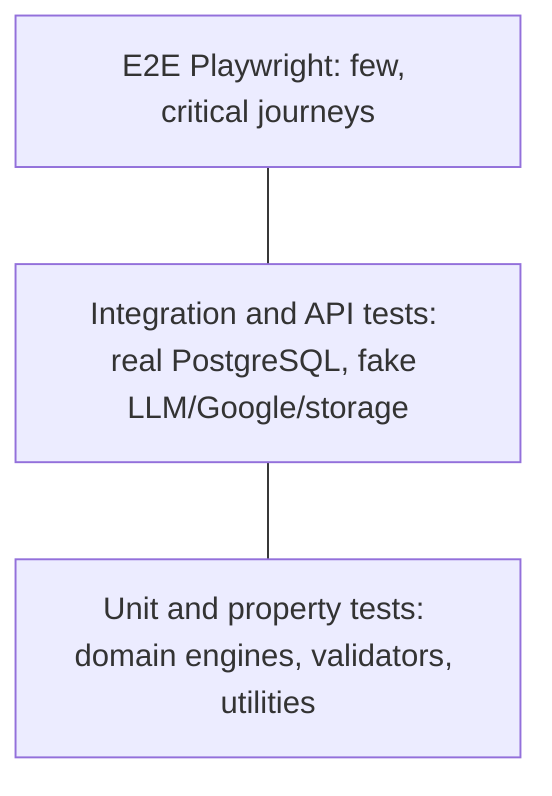

# 19. Testing Strategy

**Purpose:** define how correctness, security and quality are verified. **Scope:** backend, frontend, E2E, AI, performance.

See also: [CLAUDE.md](../CLAUDE.md) · [CI/CD](22-ci-cd.md) · [Task Planning Engine](10-task-planning-engine.md) · [AI Architecture](09-ai-architecture.md) · [Authorization](08-authorization.md)

## 1. Principles

Test behaviour at the cheapest level that proves it. Domain engines are heavily unit/property tested; HTTP and database behaviour is covered by integration tests against real PostgreSQL (with pgvector) in containers, not mocks; AI is tested with a fake provider; external services are faked at the adapter boundary. Tests are part of the Definition of Done, not a late phase (the roadmap's Phase 20 hardens and extends, it does not introduce testing).



## 2. Backend

| Type | Scope | Tools |
|---|---|---|
| Unit | Priority/Constraint/Scheduling engines, validators, calibration, effort allocation, gamification rules | pytest, Hypothesis |
| Integration | Services + repositories on PostgreSQL; transactions; jobs executed in-process | pytest, testcontainers or Compose service |
| API | Every endpoint: success, validation errors, auth required, error envelope, pagination, idempotency, optimistic concurrency | pytest + HTTP client |
| Database | Migrations upgrade/downgrade on empty and populated DB; constraints (CHECK, composite FKs, partial unique, exclusion); index presence for hot queries; soft-delete filters | pytest, Alembic |
| Authentication | Registration/login/refresh rotation, reuse detection, throttling, enumeration resistance, Google ID token verification with forged tokens, session revocation | pytest |
| Authorization | **Generated matrix:** for every `{id}` route, user B gets 404; admin cannot reach content; suspended user blocked; forged `user_id` in body rejected | route-registry driven tests |
| AI schema validation | See §4 | pytest + FakeProvider |
| Contract | OpenAPI export matches committed spec; frontend client regenerated with no diff | CI step |
| Architecture | import-linter contracts (no cross-module internals, no provider SDK outside adapters) | import-linter |

Coverage targets (recommendations): domain/engines ≥ 90% lines and mutation-sensitive property tests; overall backend ≥ 80%; every endpoint has at least one test per documented error code.

### Authentication and Authorization Tests

A CI check fails if a registered route lacks an authorization test entry, so new endpoints cannot ship without ownership coverage.

## 3. Frontend

| Type | Scope | Tools |
|---|---|---|
| Component | UI primitives and feature components, accessibility assertions | Vitest, Testing Library, axe |
| Integration | Pages with real hooks, mocked network | MSW |
| E2E | Browser journeys against a full stack with fake LLM | Playwright |

Also: type checks (`tsc --noEmit`), ESLint, visual regression optional later.

### Critical E2E Flow

```text
Register → Onboarding → Create Task → AI Breakdown → Create Roadmap
→ Start Pomodoro → Complete Task → Dashboard Updates
```

Assertions: account created and session persists across reload; onboarding saves availability; task appears; AI proposal reviewed and accepted (fake provider returns deterministic JSON); roadmap generated and shows planned sessions; Pomodoro timer counts and survives reload; completing task marks it done; dashboard focus time and completed count update. Additional E2E: Google login with a stubbed OIDC provider, file upload with a rejected type, export request, account deletion request.

## 4. AI Tests

- **Schema:** valid output accepted; missing fields, wrong types, extra fields, oversized strings rejected.
- **Business rules:** each rule in [AI Architecture §5](09-ai-architecture.md#5-business-validation-rules-task-breakdown) has a failing fixture (cycle, 20 subtasks, 0-minute estimates, unknown refs, invented URLs).
- **Retry:** repair retry succeeds on second attempt; exhaustion yields `schema_invalid`/`business_invalid`.
- **Injection:** fixtures where task text says "ignore previous instructions" must not change output shape or leak other data.
- **Quota/budget:** limits enforced before queueing; budget breaker degrades features.
- **Accept-time revalidation:** tampered `result_override` rejected.
- **Golden-set evaluation:** nightly job with a real provider on ~50 anonymised synthetic cases tracking validity rate, rule-violation rate, estimate error and cost; never blocks PRs; failures open an issue.

## 5. Integration Fakes

Fake LLM/embedding providers (scriptable), fake Google client (records calls, simulates `invalid_grant`, 403 rate limit, 410 Gone), MinIO for storage, console email provider capturing messages, controllable clock for scheduling and notification tests.

## 6. Non-Functional Tests

Performance: Locust or k6 scenarios for the top 10 endpoints and a planning run with 5,000 tasks (budget: p95 < 2 s); query plans checked for hot paths. Security: automated ZAP baseline against staging, dependency and image scans, upload fuzz corpus (polyglots, zip bombs, wrong extensions). Accessibility: axe in component and E2E tests plus a manual audit in Phase 20. Resilience: tests for worker crash and re-enqueue, Google outage, storage outage.

## 7. Test Data

Factories for all entities; deterministic UUIDs and time; a "seeded student" fixture with a realistic semester for planner tests; no production data in tests.

## 8. Gates

PRs require unit, integration, API, authorization, contract, frontend and lint/type checks green. Staging deploy runs smoke E2E. Production deploy requires staging E2E green ([CI/CD](22-ci-cd.md)).
