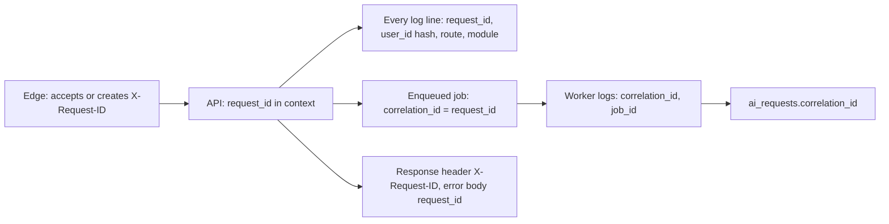

# 20. Observability

**Purpose:** make the system diagnosable without exposing student content. **Scope:** logs, traces, metrics, errors, job/DB/AI monitoring, alerts.

See also: [Backend Architecture](04-backend-architecture.md#10-logging-and-request-context) · [Deployment](21-deployment.md) · [Security](17-security.md) · [AI Architecture](09-ai-architecture.md) · [Privacy](18-privacy.md)

## 1. Pillars and Tooling

| Pillar | Approach | Tooling (architectural recommendation) |
|---|---|---|
| Logs | Structured JSON to stdout, collected by the platform | structlog; platform log drain |
| Traces | OpenTelemetry spans for HTTP, DB, jobs, outbound calls | OTel SDK + OTLP exporter (vendor neutral) |
| Metrics | RED metrics for API, queue and business metrics | OTel metrics or Prometheus endpoint (internal only) |
| Errors | Exception tracking with request id | Sentry (PII scrubbing on) |
| Uptime | External probes on `/healthz`, `/readyz`, and a synthetic login | Hosted uptime checker |

## 2. Identifiers

`request_id` identifies one HTTP request; `correlation_id` links the request to all asynchronous work it causes (jobs, AI requests, sync runs). Users quote the request id in support.

## 3. Logging Rules

Always: timestamp, level, service (`api`/`worker`), environment, release version, request_id/correlation_id, route template (not raw URL with ids), status, latency, hashed user id. API request log: method, route, status, duration, response size, rate-limit outcome. **Never:** passwords, tokens, cookies, Authorization headers, request/response bodies, task/notes/file content, AI prompts/responses, emails (use hash), Google tokens. A redaction processor drops denylisted keys; tests assert redaction.

## 4. Metrics

| Group | Metrics |
|---|---|
| API | requests, errors by class, latency histogram per route, in-flight, rate-limited count |
| Auth | logins, failures, refresh reuse detections, throttle hits |
| Database | pool usage/wait time, slow query count, connections, replication lag (if replica), disk, bloat, backup age |
| Jobs | queue depth and oldest job age per queue, run duration, retries, failed/dead jobs, periodic job last-success timestamp |
| AI | requests by feature/status, latency, tokens, cost (per day and month-to-date), schema/business validation failure rate, retries, quota rejections, provider error rate, circuit breaker state |
| Google | sync runs by outcome, API errors by code, `needs_reauth` count, token refresh failures |
| Storage | upload count/bytes, rejects by reason, scan backlog, signed URL issuance |
| Notifications | pending backlog, delivery failures |
| Product | signups, activation rate, WAU, planned-session start rate, AI proposal acceptance (aggregates only) |

## 5. Alerts

| Alert | Condition | Severity |
|---|---|---|
| API availability | `/readyz` failing 2 min, or 5xx rate > 2% for 5 min | Page |
| Latency | p95 > 1 s for 10 min on core routes | Ticket → page if sustained 30 min |
| Queue stalled | Oldest job age > 10 min (ai, sync) or periodic job missed 3 runs | Page |
| Dead jobs | Any dead-letter job from critical kinds | Ticket |
| DB | Connections > 80%, disk > 80%, backup older than 26 h, restore drill overdue | Page / ticket |
| AI cost | 70% / 90% of monthly budget; hourly cost 5× baseline | Warn / page |
| AI quality | Validation failure rate > 20% over 1 h | Ticket |
| Google | Sync failure rate > 30% for 30 min; mass `needs_reauth` | Ticket |
| Security | Refresh-reuse spike, login failure spike, admin action outside business hours | Page / review |
| Storage | Scan backlog > 15 min | Ticket |

Runbooks are linked from each alert ([Deployment](21-deployment.md#10-runbooks)).

## 6. Dashboards

Service overview (RED), jobs/queues, database health, AI usage and cost, Google sync health, security events, release comparison (error rate by version).

## 7. Failure Cases

| Case | Handling |
|---|---|
| Telemetry backend down | Application unaffected (async export, bounded buffers, drop on overflow) |
| Log volume spike | Sampling for info-level request logs; errors never sampled |
| Missing request id from client | Generated at edge or middleware |
