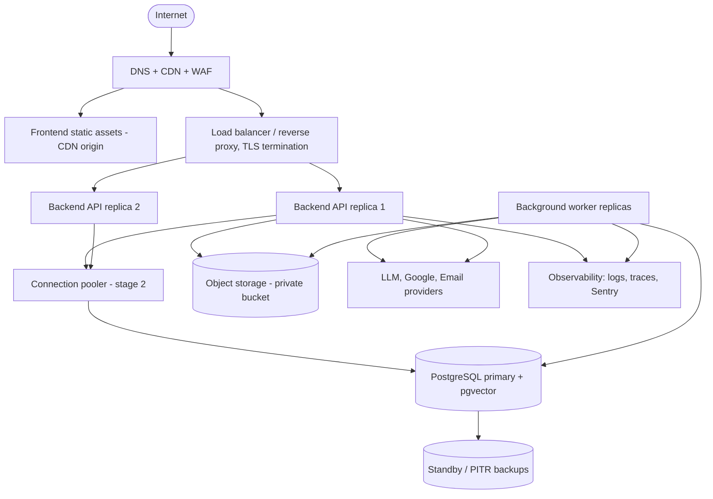

# 21. Deployment

**Purpose:** production architecture and operations. **Scope:** environments, topology, configuration, secrets, migrations, backups, monitoring, rollback. Container definitions (Dockerfiles, Compose) are written during implementation, not in this phase.

See also: [System Architecture](02-system-architecture.md) · [CI/CD](22-ci-cd.md) · [Observability](20-observability.md) · [Security](17-security.md) · [Database Design](05-database-design.md) · [File Storage](16-file-storage.md)

## 1. Production Architecture

Hosting is intentionally provider-agnostic. **Architectural recommendation:** start on a managed container platform with managed PostgreSQL that supports pgvector (verify per provider), CDN-hosted static frontend, and S3-compatible object storage; avoid Kubernetes until measured need.

## 2. Environments

| Environment | Purpose | Infrastructure | Data |
|---|---|---|---|
| **Development** | Local work | Docker Compose: PostgreSQL+pgvector, MinIO, mail sink, API, worker, web | Synthetic seed; fake LLM provider |
| **CI** | Automated tests | Ephemeral service containers | Synthetic |
| **Staging** | Pre-production verification, mirrors production topology at smaller size | Own Google Cloud project/OAuth client, own bucket and DB | Synthetic only, never production data |
| **Production** | Live | Redundant API replicas (≥ 2), ≥ 1 worker (≥ 2 recommended), managed DB with PITR | Real |

Separate credentials, buckets, databases, Google OAuth clients and LLM keys per environment.

## 3. Environment Variables

All configuration comes from environment variables loaded by typed settings that fail fast at startup. Authoritative template: [`.env.example`](../.env.example).

| Group | Variables |
|---|---|
| App | `ENVIRONMENT`, `LOG_LEVEL`, `FRONTEND_URL`, `BACKEND_URL`, `CORS_ALLOWED_ORIGINS`, `COOKIE_SECURE` |
| Database | `DATABASE_URL`, `DB_POOL_SIZE` |
| Auth | `JWT_SECRET`, `JWT_ALGORITHM`, `ACCESS_TOKEN_EXPIRE_MINUTES`, `REFRESH_TOKEN_EXPIRE_DAYS` |
| Google | `GOOGLE_CLIENT_ID`, `GOOGLE_CLIENT_SECRET`, `GOOGLE_REDIRECT_URI`, `GOOGLE_INTEGRATION_REDIRECT_URI`, `TOKEN_ENCRYPTION_KEY`, `TOKEN_ENCRYPTION_KEY_ID` |
| AI | `LLM_PROVIDER`, `LLM_API_KEY`, `LLM_MODEL_FAST`, `LLM_MODEL_STANDARD`, `EMBEDDING_PROVIDER`, `EMBEDDING_API_KEY`, `EMBEDDING_MODEL`, `EMBEDDING_DIMENSIONS`, `AI_DAILY_REQUEST_LIMIT_PER_USER`, `AI_GLOBAL_MONTHLY_BUDGET_USD` |
| Storage | `OBJECT_STORAGE_ENDPOINT`, `OBJECT_STORAGE_BUCKET`, `OBJECT_STORAGE_ACCESS_KEY`, `OBJECT_STORAGE_SECRET_KEY`, `OBJECT_STORAGE_REGION`, `UPLOAD_MAX_BYTES` |
| Email | `EMAIL_PROVIDER`, `EMAIL_API_KEY`, `EMAIL_FROM_ADDRESS` (needed from Phase 2) |
| Observability | `SENTRY_DSN`, `OTEL_EXPORTER_OTLP_ENDPOINT` |

Extra variables beyond the specification's list are justified by: cookie security, CORS, token encryption, AI model tiers and budget, email verification, and telemetry.

## 4. Secrets

Stored in the platform secret manager (or a dedicated one), injected at runtime, never baked into images or committed. Rotation: `JWT_SECRET` (dual-key window with `kid`), `TOKEN_ENCRYPTION_KEY` (re-encrypt with new key id), database and storage credentials (rolling), provider keys (overlap). Access limited to the deploy pipeline and on-call. Rotation runbooks in §10.

## 5. Database Migrations

Alembic migrations run as a **release step** before new application containers receive traffic, executed by a role with DDL rights (the runtime app role has none). Policy: **expand → migrate → contract**, so version N code works with schema N and N+1; destructive changes ship one release later; long-running backfills run as jobs, not in migrations; `CREATE INDEX CONCURRENTLY` for large tables; each migration tested up and down in CI. The API refuses to become ready if the schema is not at the expected head (`/readyz`).

## 6. Release Procedure

1. CI builds one immutable image (API + worker share it) tagged with the commit SHA.
2. Deploy to staging automatically from `main`; run migrations; smoke and E2E tests.
3. Production deploy is gated by approval; run migrations; rolling deploy API then worker; health checks gate traffic shift.
4. Post-deploy checks: readiness, synthetic login, error rate compared to baseline for 15 minutes.

## 7. Backups and Recovery

| Item | Policy |
|---|---|
| Database | Continuous WAL archiving / PITR plus daily snapshot, retained 14–30 days (≤ 35 days, see [Privacy](18-privacy.md#5-account-deletion)); encrypted |
| Targets | RPO ≤ 15 min, RTO ≤ 4 h (recommendations) |
| Object storage | Versioning off for privacy; durability from provider; export bundles are reproducible; consider cross-region replication only after a data-residency decision |
| Restore drill | Quarterly restore into an isolated environment with integrity checks; re-apply pending deletions before any production use |
| Configuration | Infrastructure definition in version control; secrets recoverable from the secret manager |

## 8. Monitoring

See [Observability](20-observability.md): health checks, dashboards, alerts, uptime probes, cost monitoring for AI and infrastructure.

## 9. Rollback Strategy

Application: redeploy the previous image tag (migrations are backward compatible with N-1, so no schema rollback is needed). Feature-level: disable via `feature_flags`. Data migrations that cannot be reversed require a backup point-in-time marker taken immediately before and an explicit approval. Worker rollback: drain queues or pause queues first when job payload formats changed (payloads are versioned and handlers accept N and N-1).

## 10. Runbooks

Planned runbooks (written in Phase 21): database failover/restore, secret rotation, queue backlog, AI provider outage and budget breach, Google token incident, storage outage, security incident ([SECURITY.md](../SECURITY.md)), account deletion backlog.

## 11. Failure Cases

| Failure | Impact and response |
|---|---|
| Bad migration | Release halted before traffic shift; fix forward or restore PITR marker |
| Region/provider outage | Static frontend stays up; API unavailable; status page; restore elsewhere from backups (RTO target) |
| Worker down | Core features work; AI/sync/notifications delayed; alert on queue age |
| Certificate expiry | Automated renewal plus expiry alerts at 14 days |
