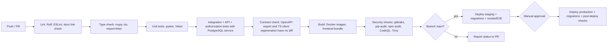

# 22. CI/CD

**Purpose:** define automated build, test, security and deploy pipelines with GitHub Actions. **Scope:** workflows, gates, environments, secrets.

See also: [Testing Strategy](19-testing-strategy.md) · [Deployment](21-deployment.md) · [Security](17-security.md) · [CONTRIBUTING.md](../CONTRIBUTING.md) · [CLAUDE.md](../CLAUDE.md)

## 1. Pipeline

## 2. Workflows

| Workflow | Trigger | Jobs |
|---|---|---|
| `ci.yml` | PR, push to any branch | backend lint/type/unit/integration (Postgres+pgvector service container), frontend lint/type/unit, contract check, docs link and Mermaid syntax check, build images (no push on PRs) |
| `security.yml` | PR, push to `main`, weekly schedule | gitleaks, pip-audit, npm audit (fail on high/critical), CodeQL (Python, TypeScript), Trivy (image + filesystem), license check |
| `e2e.yml` | PR (label-triggered or nightly) and staging deploy | Playwright suite against Compose stack with fake providers; staging smoke after deploy |
| `ai-eval.yml` | Nightly | Golden-set evaluation with a real provider (secrets limited to this workflow); never blocks PRs |
| `deploy-staging.yml` | Push to `main` after CI success | push signed image, run migrations, deploy, smoke tests |
| `deploy-production.yml` | Manual dispatch or release tag | environment protection (required reviewers), run migrations, rolling deploy, post-deploy verification, automatic halt on failed checks |
| `dependabot`/Renovate | Weekly | Dependency update PRs through the same CI |

## 3. Environments and Secrets

GitHub Environments `staging` and `production` hold environment secrets and protection rules (required reviewers for production, restricted branches/tags). Deploy credentials use short-lived OIDC federation to the cloud provider where supported instead of long-lived keys. PRs from forks receive no secrets. Real LLM and Google credentials exist only in `ai-eval` and deploy workflows.

## 4. Branch Protection and Quality Gates

`main`: required checks (lint, type, unit, integration, contract, security, build), at least one review (two for security-sensitive paths via CODEOWNERS), linear history, no force pushes, up-to-date branches before merge. Coverage thresholds from the [Testing Strategy](19-testing-strategy.md) are enforced; a drop beyond 1 point fails the check.

## 5. Build Details

One backend image serves API and worker (different commands). Frontend is built to static assets with the API base URL injected at deploy time (single artifact for all environments). Images are built with pinned base images, non-root user, minimal runtime layers, SBOM generation, and signed (cosign or provider equivalent). Caching: dependency lock files keyed caches for pip/uv and pnpm.

## 6. Release and Versioning

Semantic versioning on tags once application releases begin; changelog entries required per PR ([CHANGELOG.md](../CHANGELOG.md)); production deploys reference a tag; rollback means redeploying the previous tag ([Deployment](21-deployment.md#9-rollback-strategy)).

## 7. Failure Cases

| Case | Handling |
|---|---|
| Flaky test | Quarantine label with owner and deadline; no silent retries beyond one automatic rerun |
| Migration fails in staging | Production deploy blocked |
| Security scan finds high severity | Merge blocked; exceptions need documented risk acceptance |
| Post-deploy check fails | Automatic halt and rollback to previous tag; incident process if user impact |
