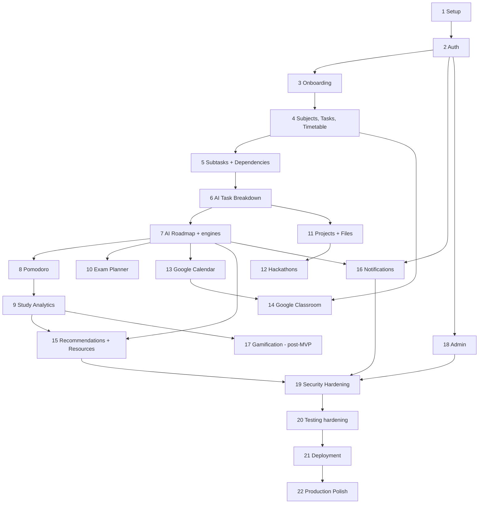

# 23. Development Roadmap

**Purpose:** ordered implementation plan. **Scope:** 22 phases, MVP boundary, dependencies, Definition of Done. Phases are sized S (≤ 1 week), M (1–2 weeks), L (2–4 weeks) for one full-stack developer; sizes are estimates, not commitments.

See also: [Product Requirements](01-product-requirements.md) · [Architecture Review](25-architecture-review.md) · [Testing Strategy](19-testing-strategy.md) · [Future Roadmap](24-future-roadmap.md) · [CLAUDE.md](../CLAUDE.md)

## 1. Release Boundary

| Release | Phases |
|---|---|
| **MVP** | 1–16, 18–22 (Phase 16 delivers in-app notifications only; Phase 18 delivers a minimal admin) |
| **Post-MVP** | 17 (gamification) and items in [Future Roadmap](24-future-roadmap.md) |

Adjustments to the recommended order (recorded in the review): Timetable is delivered in Phase 4 (needed for available-time calculation in Phase 7); the dashboard grows incrementally (v0 in Phase 4, analytics widgets in Phase 9, recommendations in Phase 15); file storage and the scanning pipeline are introduced in Phase 11 (first consumer: projects) and reused in Phase 12; resources and embeddings arrive in Phase 15; **testing is continuous in every phase** and Phase 20 adds cross-cutting suites; Google OAuth consent-screen verification must **start at the beginning of Phase 13** because of external lead time.

## 2. Dependency Graph

Parallelisable after Phase 7: Phases 8, 10, 11, 13 can proceed independently (shared dependency: Phase 7 planning). Phases 12 and 14 follow their predecessors. Phase 16 can start once events exist (after Phase 7).

## 3. Phases

Each phase lists all required fields. "Tests" are written in-phase; "Docs" are updated in-phase.

### Phase 1: Project Setup (S–M)
| Field | Content |
|---|---|
| Goal | Runnable, tested, CI-gated skeleton of the full stack |
| Features | Health endpoints; app shell; no user features |
| Database | Alembic baseline; extensions (`citext`, `vector`, `btree_gist`); `set_updated_at()` trigger function |
| Backend | App factory, typed settings, structured logging, request IDs, error envelope, DB session/UoW, module skeletons, import-linter contracts, Procrastinate wiring (empty), OpenAPI export |
| Frontend | Vite + TS strict, router shell, generated API client, HTTP layer, design tokens, error boundary |
| AI | None (FakeProvider interface stub only if needed by Phase 6) |
| Integration | Docker Compose: PostgreSQL+pgvector, MinIO, mail sink |
| Testing | pytest + container DB, Vitest, Playwright smoke, coverage reporting |
| Documentation | Local setup guide; make targets in CLAUDE.md verified |
| Dependencies | None |
| Definition of Done | `make dev` boots everything; CI green on lint, type, tests, contract check; `/readyz` verifies migration head |

### Phase 2: Authentication (L)
| Field | Content |
|---|---|
| Goal | Secure accounts and sessions |
| Features | Register, login, refresh rotation, logout, sessions, email verification, password reset, Google sign-in, throttling, audit log, consents |
| Database | `users`, `auth_identities`, `refresh_tokens`, `one_time_tokens`, `login_attempts`, `consents`, `audit_logs`, `idempotency_keys` |
| Backend | `identity` module, Argon2id, JWT, cookie handling, CSRF header check, email provider adapter, audit writer, authorization test harness (route-registry matrix) |
| Frontend | Auth pages, token store, refresh interceptor, protected routes |
| AI | None |
| Integration | Google OIDC; transactional email provider |
| Testing | Auth and enumeration tests, refresh reuse, forged ID token, matrix harness |
| Documentation | API spec §4.1 verified; ADR 006/007 reviewed |
| Dependencies | Phase 1 |
| Definition of Done | Full auth journey works in browser; all auth tests pass; every route covered by authorization matrix |

### Phase 3: Student Onboarding (M)
| Field | Content |
|---|---|
| Goal | Capture student context |
| Features | Profile, timezone, interests, goals, weekly availability, settings, terms |
| Database | `student_profiles`, `user_settings`, `interests`, `user_interests`, `goals`, `availability_windows`, `academic_terms` |
| Backend | `profile` and `academics` (terms) modules; onboarding state endpoint |
| Frontend | Onboarding wizard, settings pages |
| AI | None (AI consent captured) |
| Integration | None |
| Testing | Validation, ownership, onboarding completion rules, timezone validation |
| Documentation | API spec §4.2–4.3 |
| Dependencies | Phase 2 |
| Definition of Done | New user completes onboarding; guard redirects work; data exportable later |

### Phase 4: Subjects + Tasks (+ Timetable) (L)
| Field | Content |
|---|---|
| Goal | Core academic structure and task management |
| Features | Subjects CRUD, tasks CRUD with filters, timetable, unified read-only calendar view, dashboard v0 |
| Database | `subjects`, `timetable_entries`, `tasks` (+ ownership composite FKs, soft delete) |
| Backend | `academics`, `tasks` modules; pagination, filters, optimistic concurrency, idempotency |
| Frontend | Subjects, task list/detail, timetable editor, calendar view, dashboard v0 |
| AI | None |
| Integration | None |
| Testing | CRUD/API tests per error code, soft-delete behaviour, constraint tests |
| Documentation | API spec §4.4–4.6 (calendar), DB design verified |
| Dependencies | Phase 3 |
| Definition of Done | A student can manage subjects, tasks and timetable end to end |

### Phase 5: Subtasks + Dependencies (M)
| Field | Content |
|---|---|
| Goal | Structured work breakdown without AI |
| Features | Subtasks, ordering, task and subtask dependencies, derived blocked state, completion rules |
| Database | `subtasks`, `task_dependencies`, `subtask_dependencies` |
| Backend | Cycle detection, blocked computation, reorder, completion propagation |
| Frontend | Subtask editor, dependency picker, blocked indicators |
| AI | None |
| Integration | None |
| Testing | Cycle property tests, concurrency tests, cascade/soft delete |
| Documentation | Planning doc §6 verified |
| Dependencies | Phase 4 |
| Definition of Done | Dependency graphs always acyclic; blocked state correct in UI and API |

### Phase 6: AI Task Breakdown (L)
| Field | Content |
|---|---|
| Goal | First AI feature through the full AI Gateway |
| Features | Breakdown proposal, review/accept/reject, quotas, AI settings switch |
| Database | `ai_requests`, `ai_request_payloads`, `ai_usage_daily`, Procrastinate schema |
| Backend | `ai` module (gateway, providers, prompt manager, validators, cost tracking, sweeper), worker process, `/ai/*` endpoints |
| Frontend | Breakdown dialog with polling and editable review |
| AI | Task Breakdown Service, prompt v1, FakeProvider plus one real provider adapter |
| Integration | LLM provider |
| Testing | AI schema/business/injection/retry/quota tests; E2E with fake provider |
| Documentation | AI doc verified; ADR 008/009 reviewed |
| Dependencies | Phase 5 |
| Definition of Done | Accepted proposals create valid subtasks; raw output never persisted to domain tables; budgets enforced |

### Phase 7: AI Roadmap (L)
| Field | Content |
|---|---|
| Goal | Deterministic planning with AI explanations |
| Features | Roadmaps, planned sessions, conflicts, replan, `planner/now`, availability preview |
| Database | `roadmaps`, `roadmap_steps`, `planned_sessions` (+ exclusion constraint) |
| Backend | `planning` module: Constraint, Priority, Scheduling engines, explanation layer, replan jobs |
| Frontend | Planner week view, roadmap review/accept, conflict panel, "Now" widget |
| AI | Planning Assistant (explanations) |
| Integration | None (free/busy hook ready for Phase 13) |
| Testing | Golden and property tests for engines; DST tests; explanation fallback |
| Documentation | Planning doc finalised with tuned constants |
| Dependencies | Phase 6 (breakdown), Phase 4 (timetable) |
| Definition of Done | Same input yields same plan; no overlap or blocked-time placement; infeasibility reported |

### Phase 8: Pomodoro (M)
| Field | Content |
|---|---|
| Goal | Execution tracking |
| Features | Pomodoro with pause/resume/advance/finish, study sessions, manual logs, planned-session linkage, missed-session marker |
| Database | `study_sessions`, `pomodoro_cycles` |
| Backend | `focus` module; one-active-session constraint; missed-session job |
| Frontend | Focus page, floating timer, reload-safe countdown |
| AI | None |
| Integration | None |
| Testing | State machine tests, time-drift tests with controllable clock |
| Documentation | Lifecycle diagram verified |
| Dependencies | Phase 7 |
| Definition of Done | Timers correct across reloads/tabs; sessions link to tasks and planned sessions |

### Phase 9: Study Analytics (M)
| Field | Content |
|---|---|
| Goal | Progress insight and estimate calibration |
| Features | Daily rollups, dashboard widgets, adherence, estimate accuracy, calibration feedback to engines |
| Database | `productivity_daily_stats` |
| Backend | `analytics` module, hourly aggregation job, public calibration interface |
| Frontend | Analytics page, dashboard widgets |
| AI | None |
| Integration | None |
| Testing | Aggregation correctness, timezone boundaries, rebuild-from-source test |
| Documentation | Analytics definitions and wording rules (no health claims) |
| Dependencies | Phase 8 |
| Definition of Done | Dashboard numbers reconcile with raw sessions; calibration used by Phase 7 engines |

### Phase 10: Exam Planner (M)
| Field | Content |
|---|---|
| Goal | Exam preparation roadmaps |
| Features | Exams, topics, confidence, AI topic extraction, exam roadmap with revision passes |
| Database | `exams`, `exam_topics` |
| Backend | `exams` module, effort allocation, pass planner using planning engines |
| Frontend | Exam list/detail, topic editor, roadmap view |
| AI | Exam Planner (topic extraction, explanation) |
| Integration | None |
| Testing | Allocation property tests, infeasible cases, validation of extraction |
| Documentation | Exam doc verified |
| Dependencies | Phase 7 |
| Definition of Done | Exam roadmap respects availability and final-day rules; changes replan |

### Phase 11: Projects (+ File Storage) (L)
| Field | Content |
|---|---|
| Goal | Project tracking and the file subsystem |
| Features | Projects, project tasks, GitHub URL, AI project breakdown, file upload/download/delete |
| Database | `projects`, `files` |
| Backend | `projects` module; `resources` file service, validation pipeline, scan worker, signed URLs, reconciliation job |
| Frontend | Project pages, file panel |
| AI | Project breakdown (reuses Task Breakdown service) |
| Integration | Object storage; malware scanner |
| Testing | Upload fuzz corpus, MIME spoofing, quota, orphan cleanup |
| Documentation | File storage doc verified |
| Dependencies | Phase 6 |
| Definition of Done | Only validated, scanned, owned files are retrievable; deletion removes objects |

### Phase 12: Hackathons (M)
| Field | Content |
|---|---|
| Goal | Hackathon workspace |
| Features | Hackathons, team members, linked tasks/project/files, AI backward-planned milestones |
| Database | `hackathons`, `hackathon_team_members` |
| Backend | `hackathons` module; plan generation via planning engines |
| Frontend | Hackathon list/workspace |
| AI | Hackathon Assistant |
| Integration | None |
| Testing | Date validation, deadline-based planning, privacy of teammate data |
| Documentation | Workflow diagram verified |
| Dependencies | Phase 11 |
| Definition of Done | A hackathon can be planned from registration to submission |

### Phase 13: Google Calendar (L)
| Field | Content |
|---|---|
| Goal | Calendar sync and free/busy-aware planning |
| Features | Connect (incremental), dedicated calendar, push sessions/exams/deadlines, free/busy pull, disconnect |
| Database | `google_connections`, `calendar_event_links`, `sync_runs` |
| Backend | `google` module: token vault, client with backoff, sync jobs, needs_reauth handling |
| Frontend | Integrations settings, sync status |
| AI | None |
| Integration | Google Calendar API; **start OAuth verification**; resolve all [VERIFY] items |
| Testing | Fake Google client: invalid_grant, 403 rate limit, 410, partial scopes, idempotent retry |
| Documentation | Google doc updated with verified facts |
| Dependencies | Phase 7 |
| Definition of Done | Events created once and updated safely; free/busy affects plans; revocation handled gracefully |

### Phase 14: Google Classroom (M)
| Field | Content |
|---|---|
| Goal | Import coursework |
| Features | Course mapping, coursework import, override handling, removal marking |
| Database | `classroom_courses`, `classroom_items` |
| Backend | Classroom sync jobs, hashing, override rules |
| Frontend | Course mapping UI, import status |
| AI | None (Classroom text treated as untrusted if ever sent to AI) |
| Integration | Google Classroom API; handle Workspace admin restrictions |
| Testing | Change/override/removal scenarios, rate-limit behaviour |
| Documentation | Classroom flow verified |
| Dependencies | Phases 4, 13 |
| Definition of Done | Imported tasks stay in sync without clobbering local edits |

### Phase 15: Recommendations (+ Resources) (L)
| Field | Content |
|---|---|
| Goal | Explainable recommendations and the resource library |
| Features | Recommendation generators, ranking, feedback, resources CRUD, semantic search |
| Database | `recommendations`, `resources` (+ embeddings on `resources`, `tasks`) |
| Backend | `recommendations` module, embedding jobs, similarity queries, nightly refresh |
| Frontend | Dashboard recommendations, resource library |
| AI | Recommendation Assistant, Embedding Service |
| Integration | Embedding provider |
| Testing | Ranking determinism, wording validation, blocklist tests, embedding fallback |
| Documentation | Recommendation doc verified |
| Dependencies | Phases 7, 9 |
| Definition of Done | Every recommendation has a valid reason; dismissals reduce repeats |

### Phase 16: Notifications (M)
| Field | Content |
|---|---|
| Goal | Timely in-app notifications (email is post-MVP) |
| Features | Deadline/session/exam/conflict/sync notifications, preferences, quiet hours |
| Database | `notifications`, `notification_preferences` |
| Backend | `notifications` module, scheduler job, dedupe, state checks at send time |
| Frontend | Notification bell, feed, preferences |
| AI | None |
| Integration | None (email adapter reused from Phase 2 for post-MVP) |
| Testing | Dedupe, quiet hours, stale notification suppression, clock-driven tests |
| Documentation | Notification doc verified |
| Dependencies | Phases 2, 7 |
| Definition of Done | No duplicate or stale notifications; preferences respected |

### Phase 17: Gamification (M) — post-MVP
| Field | Content |
|---|---|
| Goal | Habit-reinforcing mechanics |
| Features | XP, levels, streaks, achievements |
| Database | `xp_events`, `achievements`, `user_achievements`, `streaks` |
| Backend | `gamification` module consuming domain events |
| Frontend | Profile/streak widgets, achievement toasts |
| AI | None |
| Integration | None |
| Testing | Idempotent awards, caps, streak/timezone tests |
| Documentation | Gamification doc verified |
| Dependencies | Phase 9 |
| Definition of Done | Rules match doc; XP rebuildable from events |

### Phase 18: Admin (S–M)
| Field | Content |
|---|---|
| Goal | Minimal safe operations console |
| Features | Aggregate metrics, account metadata, suspension, job monitor, audit view, feature flags, break-glass grants |
| Database | `admin_access_grants`, `feature_flags` |
| Backend | `admin` module (no content-module dependencies) |
| Frontend | Admin console |
| AI | None (aggregate AI cost views) |
| Integration | None |
| Testing | Admin cannot reach content (matrix), audit on every call |
| Documentation | Authorization doc verified |
| Dependencies | Phase 2 |
| Definition of Done | Admin endpoints return aggregates/metadata only; every action audited |

### Phase 19: Security Hardening (M–L)
| Field | Content |
|---|---|
| Goal | Close known risks before launch |
| Features | Admin MFA, RLS defense in depth, CSP tightening, token/secret rotation tests, rate-limit review |
| Database | `user_mfa_factors`, RLS policies |
| Backend | TOTP, RLS context per transaction, security headers audit |
| Frontend | MFA enrolment and challenge, CSP compliance |
| AI | Injection red-team review |
| Integration | Google verification completion |
| Testing | Pen test, ZAP, authz matrix extended with RLS, dependency review |
| Documentation | Security and threat model updated |
| Dependencies | Phases 15, 16, 18 |
| Definition of Done | Findings of High severity resolved; verification checklist signed off |

### Phase 20: Testing Hardening (M)
| Field | Content |
|---|---|
| Goal | Cross-cutting confidence |
| Features | Full critical E2E flow, load tests, AI golden-set evaluation, accessibility audit, resilience tests |
| Database | Query plan checks for hot paths |
| Backend | Coverage gaps closed, performance fixes |
| Frontend | Accessibility fixes, E2E stabilisation |
| AI | Nightly evaluation live |
| Integration | Fake-outage tests for Google, storage, LLM |
| Testing | As above |
| Documentation | Testing doc updated with results and thresholds |
| Dependencies | Phase 19 |
| Definition of Done | Coverage and performance targets met; critical E2E stable on CI |

### Phase 21: Deployment (M)
| Field | Content |
|---|---|
| Goal | Reproducible staging and production |
| Features | Infrastructure, pipelines, backups, monitoring, runbooks |
| Database | Managed DB with PITR; migration role separation |
| Backend | Production config, health/readiness, graceful shutdown |
| Frontend | CDN deployment with runtime config |
| AI | Production budgets and alerts |
| Integration | Production Google project, email domain, DNS/TLS |
| Testing | Staging smoke/E2E, restore drill |
| Documentation | Deployment doc and runbooks finalised |
| Dependencies | Phase 20 |
| Definition of Done | Production deploy with approval gate, tested rollback, restore drill passed |

### Phase 22: Production Polish (M)
| Field | Content |
|---|---|
| Goal | Launch readiness |
| Features | Performance tuning, empty states, copy review (no health claims), onboarding polish, status page, support docs |
| Database | Index tuning from real plans |
| Backend | Error-message review, log noise reduction |
| Frontend | UX and accessibility polish, PWA decision |
| AI | Prompt tuning from evaluation data |
| Integration | None |
| Testing | Regression pass, cross-browser |
| Documentation | User help, privacy policy and terms published, changelog |
| Dependencies | Phase 21 |
| Definition of Done | Launch checklist complete; open decisions in the review resolved |

## 4. Definition of Done (all phases)

Database implemented + migration created + backend implemented + API documented + frontend implemented + validation implemented + authorization implemented + tests written + error handling implemented + documentation updated.
